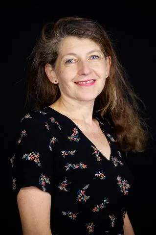

## Informations et Contact

 * **Email:** [adeline.wrona@sorbonne-universite.fr](mailto:adeline.wrona@sorbonne-universite.fr)
* **Profils:** [LinkedIn](https://www.linkedin.com/in/adeline-wrona-91273347/) | [HAL](https://hal.science/search/index/?q=%2A&rows=30&authIdPerson_i=1160435&sort=publicationDate_tdate+desc)

## Activités scientifiques

 Direction de collections
Codirection avec Hélène Védrine de la collection « Encres/écrans », anciennement « Histoire de l’imprimé », auprès de Sorbonne université presses (anciennement Presses de l’université Paris Sorbonne).
Création et coordination de la collection « Médias, communication et politique », aux éditions Les Petits matins. 8 volumes parus : Thierry Devars, La Politique en continu. Vers une BFMisation de la communication ? (2015), Juliette Charbonneaux, Les Deux corps du président. Ou comment les médias se laissent séduire par le people (2015) Alexis Lévrier, Le Contact et la distance. Le journalisme politique au risque de la connivence (2016), Emeline Seignobos et Adeline Wrona (dir.), La Fabrique de l’autorité. Figures de décideurs en régime médiatique (2017), Christian Le Bart, Johnny H., la construction d’une icône (2018), Alexis Lévrier, Jupiter et Mercure. Le pouvoir présidentiel face à la presse (2021), Juliette Charbonneaux, L’Europe face à l’épidémie. Comparaisons et sentiments médiatiques (2022).
Création et coordination de la série « Écrivains journalistes », dans le cadre de la collection GF (Flammarion). 6 volumes parus entre 2011 et 2016: Barbey d’Aurevilly journaliste (édition préparée et annotée par Pierre Glaudes),  Balzac journaliste (édition préparée et annotée par Marie-Ève Thérenty), Hugo journaliste (édition préparée et annotée par Marieke Stein) ; en Zola journaliste (édition préparée et annotée par Adeline Wrona), Baudelaire journaliste (édition préparée et annotée par Alain Vaillant), Gautier journaliste (édition préparée et annotée par Patrick Berthier).
Projets de recherche
Giranium
– « Girardin numérisé ou la naissance des industries médiatiques » : ce programme financé par l’IDEX Sorbonne Universités (appel à projet « Convergences »), pour la période 2017-2018, puis par le Labex OBVIL (Observatoire de la vie littéraire, Faculté des Lettres, Sorbonne université) pour la période 2019-2021, analyse le moment où les sociétés occidentales ont vu se mettre en place les premières industries culturelles, à travers l’exploration et la numérisation d’un corpus inédit, la correspondance d’Émile de Girardin (1806-1881). Élaboré en partenariat avec la BNF et l’Académie française, ce projet a développé des outils de recherche liés aux « humanités numériques » : les lettres ont été saisies, scannées, puis déposées sur un site ; elles sont enrichies par des métadonnées, qui permettent de croiser les sources avec l’ensemble des titres de presse numérisés sur la base Gallica. Elles entrent en dialogue avec d’autres fonds d’archives non numérisés, déposés aux Archives nationales et aux Archives de la Préfecture de Police. Ce travail a permis la création d’un « Fonds Girardin », désormais accessible à la bibliothèque de l’Institut (Académie française) et en ligne. Ce programme a donné naissance à l’ouvrage Paris, capitale médiatique, paru en 2022 aux Presses universitaires de Vincennes (PUV) ainsi qu’à la monographie Émile de Girardin. Le Napoléon de la presse (Gallimard, 2025).
Numapresse
- « Du papier à l’écran : mutations culturelles, transferts génériques, poétiques médiatiques de la presse française » : programme ANR financé sur 4 ans (2017-2021). L’objectif consistait à mettre en évidence des lignes de force structurelles de la presse française du XIXe siècle à aujourd’hui, en s’appuyant sur la numérisation des journaux mise en œuvre sous l’impulsion des bibliothèques patrimoniales, des musées et des bases de données de presse.
Transnum
- « Transformation du/par le numérique », programme soutenu par l’IDEX Sorbonne université (2017-2019), en collaboration avec Serge Bouchardon (Costech). Il s’agissait de favoriser les approches transdisciplinaires, au sein de Sorbonne université, pour penser les transformations liées au numérique, dans une perspective de temps long, en évitant la tentation représentée par le paradigme de la rupture.

## Articles

 Wrona, Adeline , « La compagnie des bêtes. Ce que les portraits d’animaux nous disent des magazines des années 50 », « Les hebdomadaires généralistes en France (1950-1970). Médiapoétique et pespectives culturelles », COntTEXTES, n°34, 2024, URL :
https://journals.openedition.org/contextes/11650
Wrona, Adeline, « Le gouvernement des portraits : autour d’Émile de Girardin », L’Esprit créateur, 59.1, « Portraitomanie and intermediality », spring 2019, URL :
https://www.espritcreateur.org/issue/la-portraitomanie-intermediality-and-portrait-19th-century-france
Wrona, Adeline, « Pour faire un bon journaliste : figures de l’auteur dans Détective », Criminocorpus, 12, 2018, URL :
https://doi.org/10.4000/criminocorpus.5438
Wrona, Adeline, « Un compagnonnage en image : Ségolène Royal et Paris Match » Communication & langages, N° 194(4), 105-113, URL :
https://doi.org/10.3917/comla.194.0105
Wrona, Adeline, « Le portrait carte, de la photographie au journal : le marché périodique du portrait d’écrivain », COnTEXTES [Online], 14 | 2014, Online since 31 May 2014, URL:
http://journals.openedition.org/contextes/5942
Wrona, Adeline, « Entre entretien littéraire et interview d’écrivain : Orhan Pamuk dans les médias français », Argumentation et analyse du discours, n°12, 2014, URL :
https://doi.org/10.4000/aad.1655
Wrona, Adeline, « Une madone à Fukushima : la condition numérique du portrait de presse », Sur Le Journalisme, About Journalism, Sobre Jornalismo, 3(1), URL :
https://doi.org/10.25200/SLJ.v3.n1.2014.137
Wrona, Adeline, « Des Panthéons à vendre : le portrait d’homme de lettres, entre réclame et biographie », Romantisme n° 155 (1/2012), pp. 37-50, URL :
http://www.revues.armand-colin.com/lettres-langue/romantisme/romantisme-ndeg-155-12012-reclame/pantheons-vendre-portrait-dhomme-lettres-entre-reclame-biographie
Wrona, Adeline, « La vie des morts : jesuismort.com, entre biographie et nécrologie », Questions de communication, n° 19(1), 2011, 73-90, URL :
https://journals.openedition.org/questionsdecommunication/2605?lang=fr
Wrona, Adeline, « Vies minuscules, vies exemplaires : récit d'individu et actualité Le cas des Portraits of Grief parus dans le New York Times après le 11 septembre 2001 » Réseaux, n°132(4), 2005, 93-110, URL :
https://shs.cairn.info/revue-reseaux1-2005-4-page-93?lang=fr

## Chapitres d’ouvrage

 Wrona, Adeline, « Grand homme ou femme de lettres ? Les nécrologies de George Sand ou les aléas d’une figure publique entre les genres », dans LEGAVRE Jean-Baptiste (dir.), Les nécrologies littéraires. Les échelles journalistiques de la grandeur, Rennes : Presses Universitaires de Rennes, 2024.
Wrona, Adeline, « Émile de Girardin, fantasme ou hantise du XIXe siècle ? », dans CORBILLÉ Sophie, FANTIN Emmanuelle, Paris, capitale médiatique, PUV, Presses Universitaires de Vincennes, 2022.
Wrona, Adeline, « Je déballe ma bibliothèque… et peut-être un peu ma mémoire. Littérature et théorie de la trivialité », dans MARTELETO Regina Maria et SALDANHA Gustavo (dirs) Yves Jeanneret - trivialité et médiations de la culture, Instituto Brasileiro de Informação em Ciência e Tecnologia, 2022.
Wrona, Adeline, « Le défi de l’actualisation : du Sang noir à Cripure », in Jean-Baptiste Legavre (dir.), Louis Guilloux dans les médias. Les réceptions de l’œuvre, Presses universitaires de Rennes, 2019, p. 189-198
Wrona, Adeline, « Quand les statues d’écrivains fondent devant l’histoire : autour d’un épisode de l’Occupation », in THÉRENTY, Marie-Ève et WRONA Adeline (dir.), Objets insignes, objets infâmes de la littérature, Paris : éditions Archives contemporaines, 2019.
Wrona, Adeline, « Journalisme », « Personnages de journalistes », « La Gazette des tribunaux », in Colette Becker et Pierre Dufief (dir.), Dictionnaire des naturalismes, Garnier, 2017.
Wrona, Adeline et Emmanuël SOUCHIER, « L'impensé du texte : pour une approche sémiotique du texte, entre "image du texte", rhétorique et médiation », Sémiotique, mode d’emploi, Karine Berthelot-Guiet et Jean-Jacques Boutaud (dir.), Le Bord de l’eau, 2016, p. 173-190.
Wrona, Adeline, « Écrire par métier : entre politique et fiction, Louis Guilloux journaliste dans la presse de l’entre-deux guerres », Louis Guilloux, un écrivain dans la presse Jean-Baptiste Legavre et Michèle Touret (dir.), Rennes, Presses universitaires de Rennes, 2014, p. 151-166.
Wrona, Adeline, « Écrire pour informer », La Civilisation du journal, Marie-Ève Thérenty, Philippe Régnier, Dominique Kalifa et Alain Vaillant (dir.), Paris, Nouveau Monde éditions, 2011, p. 1587-1601.
Wrona, Adeline, « Dénonciations », La Civilisation du journal, Marie-Ève Thérenty, Philippe Régnier, Dominique Kalifa et Alain Vaillant (dir.), Paris, Nouveau Monde éditions, 2011, p. 717-744.
Wrona, Adeline et Frédéric Lambert, « Entretien avec Umberto Eco », L’Expérience des images, Frédéric Lambert (dir.), Paris, INA éditions, 2011.

## Communications et interventions

 Wrona, Adeline, « Prendre la Une : figures féminines dans les premiers numéros de Paris Match », Journée d’études « Les newsmagazine des années 1950-1960 », Université Paul Valéry-Montpellier 3, 12 avril 2019.
Wrona, Adeline, « Houellebecq performeur ? », Colloque « Ceci est mon corps. La performance d’écrivain : spectacle, stratégie publicitaire, invention poétique », Université Paul Valéry-Montpellier 3, 31 janvier-2 février 2018.
Wrona, Adeline, « Sartre, Aron et les boat-people : médiatisation d’une réconciliation », Séminaire « Intellectuels et médias », Carism-Gripic, Celsa, 19 janvier 2018
Wrona, Adeline, « Presse, littérature et crédit à la fin du XIXe siècle » : séminaire « Littérature et paradigme fiduciaire » (Phi-IUF), organisé par Emmanuel Bouju et Emilie Piton-Foucault, Rennes, 5 décembre 2017.
Wrona, Adeline, « La loi d’imprégnation : Zola écrivain-journaliste, ou comment l'Empire survit à la République", Colloque « Sans blague aucune, c’était splendide. Regards sur le Second Empire », Auditorium du Musée d’Orsay, jeudi 24 et vendredi 25 novembre 2016.
Wrona, Adeline,  « Du portrait comme amitié : autour de Flaubert et de la portraitomanie », Journée « Flaubert et le portrait », Amis de Flaubert et Maupassant, Hôtel des sociétés savantes, Rouen, 21 mai 2016.
Wrona, Adeline, « Les portraits numériques, ou les usages sociaux d’une pratique esthétique », Séminaire de recherche « Cultures numériques », Université Paris Sorbonne, 19 mars 2016.
Wrona, Adeline, « Petites anthologies numériques : Facebook, ou la littérature en fragments partagés », Journée d’études, « Les formes brèves dans la littérature web», Université Montpellier 3, 26 novembre 2015.Wrona, Adeline, « L’école des journalistes : poétique informationnelle et formation au journalisme à la fin du 19e siècle en France », Congrès Médias 19, Paris, Centre culturel Canadien, 8 juin 2015.
Wrona, Adeline, « "Zolus ou Dreyfula". Hybridations transmédiatiques des figures de l'écrivain », L'Écrivain transmédial, Université Bar-Ilan, Tel Aviv, Lundi 24 novembre 2014.

## Direction de collections

 Codirection avec Hélène Védrine de la collection « Encres/écrans », anciennement « Histoire de l’imprimé », auprès de Sorbonne université presses (anciennement Presses de l’université Paris Sorbonne).
Création et coordination de la collection « Médias, communication et politique », aux éditions Les Petits matins. 8 volumes parus : Thierry Devars, La Politique en continu. Vers une BFMisation de la communication ? (2015), Juliette Charbonneaux, Les Deux corps du président. Ou comment les médias se laissent séduire par le people (2015) Alexis Lévrier, Le Contact et la distance. Le journalisme politique au risque de la connivence (2016), Emeline Seignobos et Adeline Wrona (dir.), La Fabrique de l’autorité. Figures de décideurs en régime médiatique (2017), Christian Le Bart, Johnny H., la construction d’une icône (2018), Alexis Lévrier, Jupiter et Mercure. Le pouvoir présidentiel face à la presse (2021), Juliette Charbonneaux, L’Europe face à l’épidémie. Comparaisons et sentiments médiatiques (2022).
Création et coordination de la série « Écrivains journalistes », dans le cadre de la collection GF (Flammarion). 6 volumes parus entre 2011 et 2016: Barbey d’Aurevilly journaliste (édition préparée et annotée par Pierre Glaudes),  Balzac journaliste (édition préparée et annotée par Marie-Ève Thérenty), Hugo journaliste (édition préparée et annotée par Marieke Stein) ; en Zola journaliste (édition préparée et annotée par Adeline Wrona), Baudelaire journaliste (édition préparée et annotée par Alain Vaillant), Gautier journaliste (édition préparée et annotée par Patrick Berthier).

## Directions de dossiers

 Wrona Adeline, avec Valérie Jeanne-Perrier et Lucie Raymond, Dossier « Informer sous algorithmes », Quaderni, n°107, automne 2022, URL :
https://doi.org/10.4000/quaderni.2420
Wrona, Adeline avec Oriane Deseilligny et (2020), Dossier « Poétisation des réseaux sociaux », Communication & langages, n°203, 2020/1, URL :
https://shs.cairn.info/revue-communication-et-langages-2020-1?lang=fr
Wrona, Adeline avec Marie-Laure Florea (2018), Dossier « Deuil en ligne. Les discours funéraires à l’ère du numérique », Semen, n°46, 2018 URL :
https://doi.org/10.4000/semen.10926
Wrona, Adeline avec Michel Murat et Marie-Ève Thérenty, Dossier « Best-sellers », Fixxion. Revue critique de fixxion contemporaine, n°15, hiver 2017,
https://doi.org/10.4000/fixxion.11756
Wrona, Adeline, Dossier « Usages médiatiques du portrait » Communication & langages, n° 152, juillet 2007, p. 35-40, URL :
https://www.persee.fr/issue/colan_0336-1500_2007_num_152_1

## Expertise

 Histoire des médias et du journalisme
Approche communicationnelle de la littérature
Genres journalistiques

## Ouvrages

 Wrona Adeline, Émile de Girardin, le Napoléon de la presse, Paris, Gallimard, 2025.
Wrona  Adeline avec Sophie Corbillé et Emmanuelle Fantin (dir.), Paris, capitale médiatique, PUV, Presses Universitaires de Vincennes, 2022.
Wrona  Adeline avec Marie-Ève Thérenty (dir.), L’Écrivain comme marque, Paris, SUP, Sorbonne Université Presses, 2022.
Wrona Adeline  avec  Emeline Seignobos, Figures de l’autorité en régime médiatique, Paris, Les Petits matins, 2017.
Wrona, Adeline, Face au portrait. De Sainte-Beuve à Facebook, Paris, Hermann, 2012.

## Projets de recherche

 Giranium
– « Girardin numérisé ou la naissance des industries médiatiques » : ce programme financé par l’IDEX Sorbonne Universités (appel à projet « Convergences »), pour la période 2017-2018, puis par le Labex OBVIL (Observatoire de la vie littéraire, Faculté des Lettres, Sorbonne université) pour la période 2019-2021, analyse le moment où les sociétés occidentales ont vu se mettre en place les premières industries culturelles, à travers l’exploration et la numérisation d’un corpus inédit, la correspondance d’Émile de Girardin (1806-1881). Élaboré en partenariat avec la BNF et l’Académie française, ce projet a développé des outils de recherche liés aux « humanités numériques » : les lettres ont été saisies, scannées, puis déposées sur un site ; elles sont enrichies par des métadonnées, qui permettent de croiser les sources avec l’ensemble des titres de presse numérisés sur la base Gallica. Elles entrent en dialogue avec d’autres fonds d’archives non numérisés, déposés aux Archives nationales et aux Archives de la Préfecture de Police. Ce travail a permis la création d’un « Fonds Girardin », désormais accessible à la bibliothèque de l’Institut (Académie française) et en ligne. Ce programme a donné naissance à l’ouvrage Paris, capitale médiatique, paru en 2022 aux Presses universitaires de Vincennes (PUV) ainsi qu’à la monographie Émile de Girardin. Le Napoléon de la presse (Gallimard, 2025).
Numapresse
- « Du papier à l’écran : mutations culturelles, transferts génériques, poétiques médiatiques de la presse française » : programme ANR financé sur 4 ans (2017-2021). L’objectif consistait à mettre en évidence des lignes de force structurelles de la presse française du XIXe siècle à aujourd’hui, en s’appuyant sur la numérisation des journaux mise en œuvre sous l’impulsion des bibliothèques patrimoniales, des musées et des bases de données de presse.
Transnum
- « Transformation du/par le numérique », programme soutenu par l’IDEX Sorbonne université (2017-2019), en collaboration avec Serge Bouchardon (Costech). Il s’agissait de favoriser les approches transdisciplinaires, au sein de Sorbonne université, pour penser les transformations liées au numérique, dans une perspective de temps long, en évitant la tentation représentée par le paradigme de la rupture.

## Publications et communications

 Ouvrages
Wrona Adeline, Émile de Girardin, le Napoléon de la presse, Paris, Gallimard, 2025.
Wrona  Adeline avec Sophie Corbillé et Emmanuelle Fantin (dir.), Paris, capitale médiatique, PUV, Presses Universitaires de Vincennes, 2022.
Wrona  Adeline avec Marie-Ève Thérenty (dir.), L’Écrivain comme marque, Paris, SUP, Sorbonne Université Presses, 2022.
Wrona Adeline  avec  Emeline Seignobos, Figures de l’autorité en régime médiatique, Paris, Les Petits matins, 2017.
Wrona, Adeline, Face au portrait. De Sainte-Beuve à Facebook, Paris, Hermann, 2012.
Directions de dossiers
Wrona Adeline, avec Valérie Jeanne-Perrier et Lucie Raymond, Dossier « Informer sous algorithmes », Quaderni, n°107, automne 2022, URL :
https://doi.org/10.4000/quaderni.2420
Wrona, Adeline avec Oriane Deseilligny et (2020), Dossier « Poétisation des réseaux sociaux », Communication & langages, n°203, 2020/1, URL :
https://shs.cairn.info/revue-communication-et-langages-2020-1?lang=fr
Wrona, Adeline avec Marie-Laure Florea (2018), Dossier « Deuil en ligne. Les discours funéraires à l’ère du numérique », Semen, n°46, 2018 URL :
https://doi.org/10.4000/semen.10926
Wrona, Adeline avec Michel Murat et Marie-Ève Thérenty, Dossier « Best-sellers », Fixxion. Revue critique de fixxion contemporaine, n°15, hiver 2017,
https://doi.org/10.4000/fixxion.11756
Wrona, Adeline, Dossier « Usages médiatiques du portrait » Communication & langages, n° 152, juillet 2007, p. 35-40, URL :
https://www.persee.fr/issue/colan_0336-1500_2007_num_152_1
Chapitres d’ouvrage
Wrona, Adeline, « Grand homme ou femme de lettres ? Les nécrologies de George Sand ou les aléas d’une figure publique entre les genres », dans LEGAVRE Jean-Baptiste (dir.), Les nécrologies littéraires. Les échelles journalistiques de la grandeur, Rennes : Presses Universitaires de Rennes, 2024.
Wrona, Adeline, « Émile de Girardin, fantasme ou hantise du XIXe siècle ? », dans CORBILLÉ Sophie, FANTIN Emmanuelle, Paris, capitale médiatique, PUV, Presses Universitaires de Vincennes, 2022.
Wrona, Adeline, « Je déballe ma bibliothèque… et peut-être un peu ma mémoire. Littérature et théorie de la trivialité », dans MARTELETO Regina Maria et SALDANHA Gustavo (dirs) Yves Jeanneret - trivialité et médiations de la culture, Instituto Brasileiro de Informação em Ciência e Tecnologia, 2022.
Wrona, Adeline, « Le défi de l’actualisation : du Sang noir à Cripure », in Jean-Baptiste Legavre (dir.), Louis Guilloux dans les médias. Les réceptions de l’œuvre, Presses universitaires de Rennes, 2019, p. 189-198
Wrona, Adeline, « Quand les statues d’écrivains fondent devant l’histoire : autour d’un épisode de l’Occupation », in THÉRENTY, Marie-Ève et WRONA Adeline (dir.), Objets insignes, objets infâmes de la littérature, Paris : éditions Archives contemporaines, 2019.
Wrona, Adeline, « Journalisme », « Personnages de journalistes », « La Gazette des tribunaux », in Colette Becker et Pierre Dufief (dir.), Dictionnaire des naturalismes, Garnier, 2017.
Wrona, Adeline et Emmanuël SOUCHIER, « L'impensé du texte : pour une approche sémiotique du texte, entre "image du texte", rhétorique et médiation », Sémiotique, mode d’emploi, Karine Berthelot-Guiet et Jean-Jacques Boutaud (dir.), Le Bord de l’eau, 2016, p. 173-190.
Wrona, Adeline, « Écrire par métier : entre politique et fiction, Louis Guilloux journaliste dans la presse de l’entre-deux guerres », Louis Guilloux, un écrivain dans la presse Jean-Baptiste Legavre et Michèle Touret (dir.), Rennes, Presses universitaires de Rennes, 2014, p. 151-166.
Wrona, Adeline, « Écrire pour informer », La Civilisation du journal, Marie-Ève Thérenty, Philippe Régnier, Dominique Kalifa et Alain Vaillant (dir.), Paris, Nouveau Monde éditions, 2011, p. 1587-1601.
Wrona, Adeline, « Dénonciations », La Civilisation du journal, Marie-Ève Thérenty, Philippe Régnier, Dominique Kalifa et Alain Vaillant (dir.), Paris, Nouveau Monde éditions, 2011, p. 717-744.
Wrona, Adeline et Frédéric Lambert, « Entretien avec Umberto Eco », L’Expérience des images, Frédéric Lambert (dir.), Paris, INA éditions, 2011.
Articles
Wrona, Adeline , « La compagnie des bêtes. Ce que les portraits d’animaux nous disent des magazines des années 50 », « Les hebdomadaires généralistes en France (1950-1970). Médiapoétique et pespectives culturelles », COntTEXTES, n°34, 2024, URL :
https://journals.openedition.org/contextes/11650
Wrona, Adeline, « Le gouvernement des portraits : autour d’Émile de Girardin », L’Esprit créateur, 59.1, « Portraitomanie and intermediality », spring 2019, URL :
https://www.espritcreateur.org/issue/la-portraitomanie-intermediality-and-portrait-19th-century-france
Wrona, Adeline, « Pour faire un bon journaliste : figures de l’auteur dans Détective », Criminocorpus, 12, 2018, URL :
https://doi.org/10.4000/criminocorpus.5438
Wrona, Adeline, « Un compagnonnage en image : Ségolène Royal et Paris Match » Communication & langages, N° 194(4), 105-113, URL :
https://doi.org/10.3917/comla.194.0105
Wrona, Adeline, « Le portrait carte, de la photographie au journal : le marché périodique du portrait d’écrivain », COnTEXTES [Online], 14 | 2014, Online since 31 May 2014, URL:
http://journals.openedition.org/contextes/5942
Wrona, Adeline, « Entre entretien littéraire et interview d’écrivain : Orhan Pamuk dans les médias français », Argumentation et analyse du discours, n°12, 2014, URL :
https://doi.org/10.4000/aad.1655
Wrona, Adeline, « Une madone à Fukushima : la condition numérique du portrait de presse », Sur Le Journalisme, About Journalism, Sobre Jornalismo, 3(1), URL :
https://doi.org/10.25200/SLJ.v3.n1.2014.137
Wrona, Adeline, « Des Panthéons à vendre : le portrait d’homme de lettres, entre réclame et biographie », Romantisme n° 155 (1/2012), pp. 37-50, URL :
http://www.revues.armand-colin.com/lettres-langue/romantisme/romantisme-ndeg-155-12012-reclame/pantheons-vendre-portrait-dhomme-lettres-entre-reclame-biographie
Wrona, Adeline, « La vie des morts : jesuismort.com, entre biographie et nécrologie », Questions de communication, n° 19(1), 2011, 73-90, URL :
https://journals.openedition.org/questionsdecommunication/2605?lang=fr
Wrona, Adeline, « Vies minuscules, vies exemplaires : récit d'individu et actualité Le cas des Portraits of Grief parus dans le New York Times après le 11 septembre 2001 » Réseaux, n°132(4), 2005, 93-110, URL :
https://shs.cairn.info/revue-reseaux1-2005-4-page-93?lang=fr
Communications et interventions
Wrona, Adeline, « Prendre la Une : figures féminines dans les premiers numéros de Paris Match », Journée d’études « Les newsmagazine des années 1950-1960 », Université Paul Valéry-Montpellier 3, 12 avril 2019.
Wrona, Adeline, « Houellebecq performeur ? », Colloque « Ceci est mon corps. La performance d’écrivain : spectacle, stratégie publicitaire, invention poétique », Université Paul Valéry-Montpellier 3, 31 janvier-2 février 2018.
Wrona, Adeline, « Sartre, Aron et les boat-people : médiatisation d’une réconciliation », Séminaire « Intellectuels et médias », Carism-Gripic, Celsa, 19 janvier 2018
Wrona, Adeline, « Presse, littérature et crédit à la fin du XIXe siècle » : séminaire « Littérature et paradigme fiduciaire » (Phi-IUF), organisé par Emmanuel Bouju et Emilie Piton-Foucault, Rennes, 5 décembre 2017.
Wrona, Adeline, « La loi d’imprégnation : Zola écrivain-journaliste, ou comment l'Empire survit à la République", Colloque « Sans blague aucune, c’était splendide. Regards sur le Second Empire », Auditorium du Musée d’Orsay, jeudi 24 et vendredi 25 novembre 2016.
Wrona, Adeline,  « Du portrait comme amitié : autour de Flaubert et de la portraitomanie », Journée « Flaubert et le portrait », Amis de Flaubert et Maupassant, Hôtel des sociétés savantes, Rouen, 21 mai 2016.
Wrona, Adeline, « Les portraits numériques, ou les usages sociaux d’une pratique esthétique », Séminaire de recherche « Cultures numériques », Université Paris Sorbonne, 19 mars 2016.
Wrona, Adeline, « Petites anthologies numériques : Facebook, ou la littérature en fragments partagés », Journée d’études, « Les formes brèves dans la littérature web», Université Montpellier 3, 26 novembre 2015.Wrona, Adeline, « L’école des journalistes : poétique informationnelle et formation au journalisme à la fin du 19e siècle en France », Congrès Médias 19, Paris, Centre culturel Canadien, 8 juin 2015.
Wrona, Adeline, « "Zolus ou Dreyfula". Hybridations transmédiatiques des figures de l'écrivain », L'Écrivain transmédial, Université Bar-Ilan, Tel Aviv, Lundi 24 novembre 2014.

## Thématiques de recherche

 Les grandes figures d’écrivains journalistes en France au XIXe siècle, en particulier Émile de Girardin et Émile Zola
Formes et formats d’écriture dans les médias
La fonction auteur en régime médiatique

