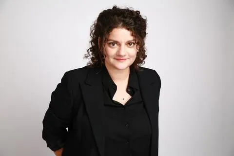

## Informations et Contact

 * **Email:** [ambre.abid.dalencon@gmail.com](mailto:ambre.abid.dalencon@gmail.com)
* **Profils:** [LinkedIn](https://www.linkedin.com/in/ambreabiddalencon/?originalSubdomain=fr) | [HAL](https://hal.science/search/index/?q=%2A&rows=30&authFullName_s=Ambre+Abid-Dalen%C3%A7on&sort=publicationDate_tdate+desc)

## Activités scientifiques

 Été 2016 - mars 2017 : recherches définitionnelles pour les contenus de l’exposition « Nous et les autres. Des préjugés au racisme » (Musée de l’Homme, du 31 mars au 8 janvier 2018) et pour un livret à destination du centre de ressources du musée.
Décembre 2014 - février 2015 : support et conseil éditorial pour la 7e édition du Communicator, en collaboration avec les éditions Dunod et l’institut d’études Occurrence.
Projet de recherche
De 2016 à 2018 : Membre du projet de recherche GIRANIUM (« Girardin numérisé, ou la naissance des industries culturelles »).
De 2014 à 2018 : Co-animation de l’axe de recherche « Médiations marchandes » du GRIPIC.

## Communications et interventions

 Séminaire GIRANIUM (GRIPIC) : ABID-DALENÇON Ambre, CHARBONNEAUX Juliette, « Mouvements de professionnalisation au sein des industries médiatiques naissantes : journalistes, publicistes, publicitaires et écrivains. Corpus issu du projet GIRANIUM », CELSA, 17 mai 2018.
Séminaire de l’axe « Médiations marchandes » (GRIPIC) : ABID-DALENÇON Ambre, « La revue pro-fessionnelle en communication : un objet passeur ? Troubles et figements représentationnels au sein d’un espace éditorial », CELSA, 9 avril 2016.
Séminaire de lecture du GRIPIC : ABID-DALENÇON Ambre, FANTIN Emmanuelle, « La publicité dans l’œuvre de Jean Baudrillard », séance de lecture du laboratoire, CELSA, 6 avril 2016.

## Expertises et enseignements

 Les recherches d’Ambre Abid-Dalençon s’intéressent aux modes de publicisation des professions de la communication. Sa thèse a notamment questionné la célébration de périodiques professionnels hybrides, dont le format rend compte des enjeux de savoir, de reconnaissance et de pouvoir inhérents aux médiations. Interrogeant les dynamiques d’association et/ou de concurrence professionnelle au sein du vaste domaine de la communication, ses travaux s’inscrivent dans la tradition des recherches portant sur la question des frontières et de leurs (re)définitions symboliques.

## Projet de recherche

 De 2016 à 2018 : Membre du projet de recherche GIRANIUM (« Girardin numérisé, ou la naissance des industries culturelles »).
De 2014 à 2018 : Co-animation de l’axe de recherche « Médiations marchandes » du GRIPIC.

## Publications et communications

 Communications et interventions
Séminaire GIRANIUM (GRIPIC) : ABID-DALENÇON Ambre, CHARBONNEAUX Juliette, « Mouvements de professionnalisation au sein des industries médiatiques naissantes : journalistes, publicistes, publicitaires et écrivains. Corpus issu du projet GIRANIUM », CELSA, 17 mai 2018.
Séminaire de l’axe « Médiations marchandes » (GRIPIC) : ABID-DALENÇON Ambre, « La revue pro-fessionnelle en communication : un objet passeur ? Troubles et figements représentationnels au sein d’un espace éditorial », CELSA, 9 avril 2016.
Séminaire de lecture du GRIPIC : ABID-DALENÇON Ambre, FANTIN Emmanuelle, « La publicité dans l’œuvre de Jean Baudrillard », séance de lecture du laboratoire, CELSA, 6 avril 2016.

## Thématiques de recherche

 Savoirs, culture et communication
Transformations des formes culturelles et médiatiques
Professions et professionnisme
Professions publicitaires
Journalisme et communication
Littérature et communication

