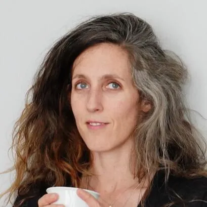

## Informations et Contact

 * **Profils:** [LinkedIn](https://www.linkedin.com/in/camille-brachet-99557a50/) | [HAL](https://hal.science/search/index/?q=%2A&rows=30&authIdPerson_i=1359597&sort=publicationDate_tdate+desc)

## Expertises

 Enseignante-chercheuse en Sciences de lInformation et de la communication, je travaille depuis des années sur la médiatisation de la culture et de la gastronomie dans le cadre de mes activités de recherche. Jai par ailleurs toujours souhaité porter ces réflexions dans les médias et sur la base de mes quelques expériences radiophoniques, je produis un podcast,
CEUX QUI NOUS LIENT
, afin de donner la parole à des personnalités très différentes sur un sujet aussi transversal que la gastronomie envisagée comme une production culturelle.

