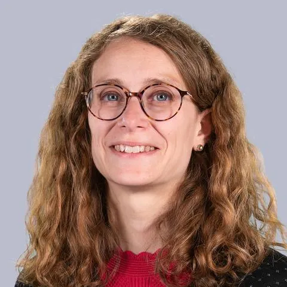

## Informations et Contact

 * **Email:** [camille.rondot@sorbonne-universite.fr](mailto:camille.rondot@sorbonne-universite.fr)
* **Profils:** [LinkedIn](https://www.linkedin.com/in/camille-rondot-3508b543/) | [HAL](https://hal.science/search/index/?q=%2A&rows=30&authIdPerson_i=1150176&sort=publicationDate_tdate+desc)

## Expertises

 Ses recherches portent sur l’analyse des médiations et des enjeux de médiatisation, que ce soit dans les institutions culturelles, du savoir et/ou politique.
Elle s’intéresse de façon privilégié aux enjeux de pouvoirs liés à l’investissement des médias informatisés.

## Thématiques de recherche

 Analyse des médiations et des enjeux de médiatisation (culturelle, politique et des savoirs)
Communication des organisations intergouvernementales
Communication politique
Connaissance des institutions culturelles et de transmission des savoirs (bibliothèques, centres d’art, musées)

