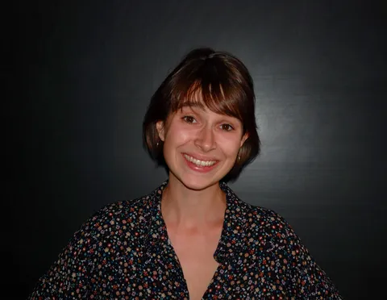

## Informations et Contact

 * **Email:** [clotildechevet@gmail.com](mailto:clotildechevet@gmail.com)
* **Profils:** [LinkedIn](https://www.linkedin.com/in/clotilde-chevet-9a1660122) | [Twitter](https://x.com/clotildechevet)
* **CV:** [Télécharger le CV](https://kit-117.sorbonne-universite.fr/sites/default/files/media/2022-09/CHEVET%20Clotilde%20-%20CV%20universitaire.pdf)

## Autres activités scientifiques

 C-ACTI : Communications avec actes dans un congrès international ou national
« L’interaction homme-machine : un système d’écritures qui fait monde ». Doctorales de la SFSIC, le 23 juin 2022 à l’Université de Dijon.
« Vie et voix du Allôland » - Colloque européen sur le Pharmaphone, 16-18 janvier 2020, Villa Tamaris, Toulon.
« Quel contrat de communication pour "l’interaction homme-machine ?" Le cas des chatbots médiatiques » - Colloque international sur le contrat de communication, 9-11 septembre 2019, Université Laval, Québec.
« Les chatbots, des cadavres exquis de citations ? » - Colloque international Ci-dit, 20-22 juin 2018, Université libre de Bruxelles.
« Le design conversationnel au service de l’attachement chez les assistants personnels numériques » - Congrès WACAI sur les « Affects, Compagnons Artificiels et Interactions », 13-15 juin 2018 à Porquerolles.
C-COM : Communications sans actes dans un congrès international ou national
« Du cybermilitantisme djihadiste à la cybersexualité : enjeux, défis et limites éthiques de deux ethnographies en ligne ». Intervention à deux voix avec Laurène RENAUT, Colloque Ludovia, Ax les Thermes le 24 août 2022.
« Dialoguer avec son téléphone : entre mythe relationnel et réalité technique », dans le cadre du cycle de conférences organisé par le FEC de Strasbourg, le 27 janvier 2020.
« Siri, le robot qui m’aimait ? Etude des ressorts linguistiques d’une “ingénierie de l’enchantement” » - Colloque international sur « L’Attachement aux cyber-choses : logiciels sentimentaux, love-bots et séducteurs de synthèse », Université Paris Nanterre, 15 juin 2017.
« L’application Siri, un « être de langage » ? Regard sur les pratiques d’écriture et d’oralité dans le cadre de « l’interaction homme-machine », Colloque international « RIAL 2016 : Rencontres internationales d'anthropologie linguistique - l’être de langage, entre corps et technique : nouvelles données, nouvelle donne ? » Montpellier, 25 mars 2016.
Séminaires et journées d’étude
« Observation incognito en e-terrains “sensibles” : une recherche interdite ? » Présentation avec Laurène RENAUT Journée d’étude « Éthique et numérique » JEJC Université Paris Cité - 16 juin 2022.
Table ronde « : « Impact, valeur et éthique de la recherche » Présentation avec Laurène RENAUT, Journée d’études interdisciplinaire Sorbonne Actuelle, Campus Jussieu, 22 avril 2022.
« Corps à corps avec un logiciel », Journée d’étude du Robotic by design Lab, Ecole de design Strate, 21 juin 2021.
Introduction de la table-ronde « Recherche et financement : engagement, embarquement et empêchements », Journée d’étude consacrée aux « Fabriques de l’ignorance », Maison de la recherche Serpente, 17 juin 2020.
« L’interaction homme machine » : un nouveau rapport à soi, à la machine et au monde » - Séminaire doctoral Transnum, à la maison de la Recherche Serpente, le 7 Novembre 2019.
« La fabrique de l’ignorance : réflexion sur l’industrie des assistants personnels numériques », Matinée d’étude du GRIPIC, 30 janvier 2019.
« Replika : une IA au bout du fil », Journée d’étude Vox machines, Université de Toulouse Jean Jaurès, le 10 décembre 2018.
« Siri, un artefact d’humanité ? Reflet de l’homo communicans dans la machine » - Séminaire 2017-2018 de l’URMIS – Université Paris Diderot sur le thème : « Frontières de l’humain : problématiques contemporaines – Interfaces », 13 février 2018.
« Un chemin de conversation caché. L’écriture de l’interaction homme- machine » - Séminaire doctoral Chemins d’écritures Maison de la recherche Serpente, 8 juin 2018.
« Sensorialité et analyses techno-sémiotiques » présentation avec Inès Garmon. Matinée d’étude du GRIPIC sur le thème : « La question du "numérique" au GRIPIC », 4 avril 2018.
Ressources audio ou vidéo
Emission « La recherche montre en main » sur France Culture, 1er mai 2019. URL :
https://www.radiofrance.fr/franceculture/podcasts/la-recherche-montre-en-main/l-interaction-homme-machine-un-systeme-d-ecriture-qui-fait-monde-2313131
Evénement « Il était une fois…demain ». Sorbonne Université. Vidéo youtube url:
https://www.youtube.com/watch?v=jE1TPbXVynI&ab_channel=SorbonneUniversit%C3%A9

## Expertises et enseignements

 Les recherches de Clotilde Chevet portent sur les assistants vocaux, ces « êtres de langage » partagés entre écriture et oralité, code informatique et langage naturel. Par l'étude de ces objets, elle cherche à décrire la mimesis communicationnelle caractérisant "l'interaction humain-machine". À la croisée de l’enquête théorique, de l’anthropologie et de la recherche-création, sa thèse fait ainsi l'étude d'un système d'écritures mimétique qui organise et renouvelle le rapport à soi et à l’autre.

## L’Intelligence Artificielle générative au service de l’identité nationale ou l’essor d’un patriotisme technologique

 Laurène Renaut, Clotilde Chevet, Lucie Raymond, Samuel Vernet
Ecole d’hiver de l’Institut des Humanités Numériques (IDHN), CY Cergy Paris Université, Dec 2024, L'Isle-Adam, France. ⟨hal-05682163⟩

## Post Update Blues : Pourquoi mon amie est-elle devenue si robotique ?

 Clotilde Chevet
Terrain : anthropologie et sciences humaines [Anciennement : Carnets du patrimoine ethnologique ; Revue d'ethnologie de l'Europe], 2021. ⟨hal-03723004⟩

## Publications

 Toutes les publications sur HAL

## Quel contrat de communication pour « l’interaction homme-machine » ? Le cas des chatbots médiatiques

 Clotilde Chevet
Études de communication publique, 2020. ⟨hal-03723018⟩

## Re-générer la musique de propagande identitaire sur les réseaux socionumériques : la rhétorique de la “ remigration ” en chansons

 Justine Simon, Clotilde Chevet, Lucie Raymond, Laurène Renaut
Cette communication analyse la manière dont la rhétorique de la « remigration », concept central de l’extrême droite française, est aujourd’hui mise en musique et diffusée via les réseaux socionumériques. L’étude repose sur deux corpus complémentaires : d’une part, cinq clips générés par IA et…
Journée d’étude interdisciplinaire et internationale « La musique comme instrument. L’usage de la musique dans la communication politique », ELLIADD, Université Marie et Louis Pasteur, Projet de recherche "LaSiDo: La Politique en Musique", Nov 2025, Besancon, France, France. https://elliadd.univ-fcomte.fr/lasido-la-politique-en-musique. ⟨hal-05356641⟩

## Thématiques de recherche

 Ethique de la recherche
Anthropologie de l’écriture
Ethnographie en ligne
Ecriture et oralité
Interaction homme-machine
Télécharger le CV
Publications
Toutes les publications sur HAL
Article dans une revue
Quel contrat de communication pour « l’interaction homme-machine » ? Le cas des chatbots médiatiques
Clotilde Chevet
Études de communication publique, 2020. ⟨hal-03723018⟩
Article dans une revue
Post Update Blues : Pourquoi mon amie est-elle devenue si robotique ?
Clotilde Chevet
Terrain : anthropologie et sciences humaines [Anciennement : Carnets du patrimoine ethnologique ; Revue d'ethnologie de l'Europe], 2021. ⟨hal-03723004⟩
Communication dans un congrès
L’Intelligence Artificielle générative au service de l’identité nationale ou l’essor d’un patriotisme technologique
Laurène Renaut, Clotilde Chevet, Lucie Raymond, Samuel Vernet
Ecole d’hiver de l’Institut des Humanités Numériques (IDHN), CY Cergy Paris Université, Dec 2024, L'Isle-Adam, France. ⟨hal-05682163⟩
Communication dans un congrès
Re-générer la musique de propagande identitaire sur les réseaux socionumériques : la rhétorique de la “ remigration ” en chansons
Justine Simon, Clotilde Chevet, Lucie Raymond, Laurène Renaut
Cette communication analyse la manière dont la rhétorique de la « remigration », concept central de l’extrême droite française, est aujourd’hui mise en musique et diffusée via les réseaux socionumériques. L’étude repose sur deux corpus complémentaires : d’une part, cinq clips générés par IA et…
Journée d’étude interdisciplinaire et internationale « La musique comme instrument. L’usage de la musique dans la communication politique », ELLIADD, Université Marie et Louis Pasteur, Projet de recherche "LaSiDo: La Politique en Musique", Nov 2025, Besancon, France, France. https://elliadd.univ-fcomte.fr/lasido-la-politique-en-musique. ⟨hal-05356641⟩
Toutes les publications sur HAL

