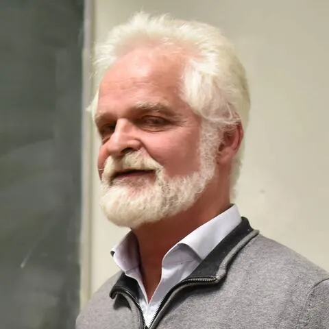

## Informations et Contact

 * **Email:** [emmanuel.souchier@wanadoo.fr](mailto:emmanuel.souchier@wanadoo.fr)
* **Profils:** [HAL](https://hal.science/search/index/?q=%2A&rows=30&authIdPerson_i=1149999&sort=publicationDate_tdate+desc)

## Activités scientifiques

 Membre du comité scientifique de la revue Comicalités ; du comité de lecture de la revue Semem et de la Revue française des sciences de l’information et de la communication.
Responsable avec Elsa Tadier (Université Paris Cité – Cerilac) Anne Zali (Bibliothèque nationale de France) du séminaire doctoral Chemins d’écritures, Maison de la recherche, Lettres - Sorbonne Université depuis 2014.
Co-fondateur et directeur scientifique du Colloque International Icône-Image, Télécom ParisTech, Cnrs, Sorbonne Université, Université de Dijon, Centre d’Art de l’Yonne, Musées de Sens et d’Auxerre, MSH de Dijon, 2004 – 2006.
Co-fondateur du Rendez-vous des Lettres avec Catherine Bizot (MEN) et Anne Zali (BnF), Ministère de l’Éducation nationale, Gripic – Celsa Sorbonne Université, École Estienne, 2010 - 2012.

## Articles

 - Souchier Emmanuël, « Penser le “stade de l’écriture” à partir d’
Orion aveugle
de Claude Simon. Prélude à l’énonciation éditoriale »,
Communication & langages
, n° 218, 2023, p. 3-22. URL :
https://doi.org/10.3917/comla1.218.0003
- Souchier Emmanuël, Pomian Joanna, « Qui cause ? Qui dose ? Qui ose ? À l’infini poème apporter une fin », “Des textes au sens. Ce que les innovations technologiques ne prouvent pas”, Anquetil S. et Pignier N. (dir.),
Interfaces
Numériques
, vol. X, n°3, 2022. URL :
https://www.unilim.fr/interfaces-numeriques/4677#ftn14
- Souchier Emmanuël, « Histoire d’une rencontre. Retour sur l’
architexte
», Centre d’étude de l’écriture et de l’image, Université́ Paris Diderot,
écriture
et image,
n° 2, 2021. URL :
https://ecriture-et-image.fr/index.php/ecriture-image/article/view/57/41
- Souchier Emmanuël, « Relire la méthode d’Ivan Illich. Cheminer vers des sciences “humaines” ? »,
Communication & langages
, n°204, 2020, p. 49-78. URL :
https://doi.org/10.3917/comla1.204.0049
- Souchier Emmanuël, « Le carnaval typographique de Balzac. Premiers éléments pour une théorie de l’irréductibilité sémiotique »,
Communication & langages
, n°185, 2015, p. 3-22. URL :
https://doi.org/10.3917/comla.185.0003
.
- Souchier Emmanuël, « La mémoire de l’oubli : éloge de l’aliénation Pour une poétique de “l’infra-ordinaire” »,
Communication & langages
, n° 172, 2012, p. 3-19. URL :
https://doi.org/10.4074/S0336150012002013
- Souchier Emmanuël, « La “lettrure” à l’écran Lire & écrire au regard des médias informatisés.»,
Communication & langages
, n° 174, 2012, p. 85-108. URL :
https://doi.org/10.4074/S0336150012014068
- Trad. brésilienne, « Da “Lettrure” à tela: ler e escrever sob o olhar das mídias informatizadas »,
Ensino
em
Re-Vista
, vol. 22, n° 1, janv.-juin. 2015, p 211-229. URL :
https://seer.ufu.br/index.php/emrevista/article/view/30722
- Souchier Emmanuël, « Formes et pouvoirs
de l’énonciation éditoriale »,
Communication & langages
, n° 154, 2007, p. 23-38. URL :
https://doi.org/10.3406/colan.2007.4688
- Souchier Emmanuël, Jeanneret Yves, « L'énonciation éditoriale dans les écrits d'écran »,
Communication & langages
, n° 145, 2007, p. 3-15. URL :
https://doi.org/10.3406/colan.2005.3351
- Souchier Emmanuël, « Mémoires - outils - langages. Vers une “société du texte” ? »,
Communication & langages
, n° 139, 2004, p. 41-52. URL :
https://doi.org/10.3406/colan.2004.3251

## Chapitres d’ouvrage

 - Souchier Emmanuël, « La mémoire culturelle de la
forme livre
. Ruptures et continuités d’un support de
lettrure
»,
Le livre face au
numérique
. La disruption a-t-elle eu lieu ?
, Frédérique Giraud et Céline Guillot (dir.), Lyon, Presses de l’ENSSIB, 2023, p. 90-100.
- Souchier Emmanuël, « Lecture, typographie et mémoire de l’oubli. Les ressorts de l’énonciation éditoriale »,
À la poursuite du livre
rêvé
́ par Jean Giono et Maximilien Vox. Dialogues typographiques,
M.-A. Bailly- Maître (dir.) avec les étudiants du master 2 Métiers du livre et de l’édition de Caen 2020-2021, Lurs, Rencontres internationales de Lure / Manosque, Centre Jean Giono, 2021, p. 108-127.
- Souchier Emmanuël, « L’atelier d’écriture. S’approprier la chair chaude des mots », Cécile de Bary (dir.),
Les ateliers d’
écriture
et l’Oulipo
, Hermann, 2020, p. 187-205.
- Souchier Emmanuël, Wrona Adeline, « L’impensé du texte. Pour une approche sémiotique du texte, entre “image du texte”, rhétorique & médiation »,
Sémiotique
mode d’emploi
, K. Berthelot-Guiet et J.-J. Boutaud (dir.), Le Bord de l’eau éd., 2014, p. 173-189.
- Souchier Emmanuël, « Le texte, objet d’une poïétique sociale »,
Que faisons-nous du texte ?
, Presses universitaires de Paris-Sorbonne, 2012, p. 23-33.
- Souchier Emmanuël, Candel Étienne et Jeanne-Perrier Valérie, « Petites formes, grands desseins : d’une grammaire des énoncés éditoriaux à la standardisation des écritures »,
L’
Économie
des
écritures
sur le web
, Davallon Jean dir., Hermes Lavoisier, 2012, p. 165-201.
- Souchier Emmanuël, avec J. Bonaccorsi, I. Garron, S. Labelle et J.-L. Minel, « Réécritures appareillées : appropriations de l’œuvre de Raymond Queneau sur Internet »,
L’
écriture
des
médias
informatises
. Espaces de pratiques
, C. Tardy et Y. Jeanneret (dir.), Hermes Lavoisier, 2007, p. 173- 204.
- Souchier Emmanuël, « Une écriture de réseau, le
portail
comme pratique éditoriale »,
L’imaginaire de l’
écran
/
Screen
Imaginary
,
N. Roelens et Y. Jeanneret (dir.), Rodopi, Amsterdam - Atlanta, 2004, p. 163-173.
- Souchier Emmanuël, « Lorsque les écrits de réseaux cristallisent la mémoire des outils, des médias et des pratiques… »,
Les
défis
de la publication sur le Web :
hyperlectures
,
cybertextes
et
méta-édition
, J.-M. Salaün et Ch. Vandendorpe (dir.), coll. “Références”, Presses de l’ENSSIB, Lyon, 2004, p. 87-100. URL :
https://www.enssib.fr/bibliotheque-numerique/documents/68263-les-defis-de-la-publication-sur-le-web.pdf
- Souchier Emmanuël, « Le
sens formel
d’un manuscrit »,
Histoire de l’
écriture
: de l’
idéogramme
au
multimédia
, A.-M. Christin dir., Flammarion, 2001, p. 342-344.
-
Trad. américaine, “The
formal meaning
of a manuscrit”,
A History of Writing, from Ideogram to Multimedia.
New York, Flammarion.
-
Trad. arabe, Bibliothèque Alexandrina, Alexandrie, Égypte, 2005.
- Souchier Emmanuël, « Histoires de page et pages d’histoire »,
L’aventure des
écritures
, La page
, A. Zali dir., Bibliothèque nationale de France, 1999, p. 19-55.

## Communications et interventions

 - Souchier Emmanuël, « Une archéologie de l’énonciation éditoriale avec Massin », Colloque
Massin
. L’imagination (graphique) au pouvoir
, ISIA - Istituto Superiore per le Industrie Artistiche, Urbino, Italia, 19 mai, 2021. URL :
Conférence de 2:31:56 à 3:36:42
;
Échanges à partir de 2:13:00
.
- Souchier Emmanuël, « Balzac et la typographie. Questions d’intermédialité ? », Département des littératures de langue française, CRIALT, Université de Montréal, Québec, 11 septembre 2019.
- Souchier Emmanuël, « Le numérique comme écriture », CRILQ, CRIHN, CRSH du Canada, Université de Laval, Montréal, Québec, 13 septembre 2019. URL :
https://archive.org/details/conferenceemmanuelsouchieron2019091318541
- Souchier Emmanuël, « Les mots du design »,
Conference
Cumulus Paris 2018
Together
to
get
there
, Césaap - Écoles Boule, Duperré, Estienne, ENSAAMA, Académie de Paris, MEN – MESRI, 11-13 avril 2018.
- Souchier Emmanuël, « Énoncer l’énonciation éditoriale »,
Médias, Culture, Communication
, Université de Liège, Liège, 28 février 2018.
- Souchier Emmanuël, « Éléments pour une épistémologie du design en contexte numérique », Deuxième colloque ÉCRIDIL
Le livre, défi de design : l’intersection numérique de la création et de l’édition,
Écrire, éditer, lire à l’ère du numérique
, Montréal, CRSH du Canada, Université de Laval, 30 avril – 1er mai, 2018. URL :
https://www.youtube.com/watch?v=_tjVEWtZcVQ&t=167s
- Souchier Emmanuël et Belleguie André, « Les Rendez-vous des métiers du livre »,
Acteurs de la création graphique contemporaine,
Rencontre avec le plasticien et graphiste André Belleguie
, Bibliothèques de l’Arsenal et Forney, Bibliothèque de l’Arsenal, 30 janvier 2017. URL :
https://www.bnf.fr/fr/agenda?seance=1223926077376
- Souchier Emmanuël, «
Et demain j’apprends quoi ? Le leurre démocratique du code
”,
Pratiques d’écritures numériques en situations d’apprentissage
, ESPE de Rouen, Université de Rouen, ANR Translit, 13 janvier 2016. URL :
https://webtv.univ-rouen.fr/videos/2-demain-japprends-quoi-le-leurre-democratique-du-code-par-emmanuel-souchier/
- Souchier Emmanuël, « Questions autour de “l’irréductibilité sémiotique”
&
de la “polyphonie énonciative” de l’écriture. Le
carnaval typographique
de Balzac ou le “dict” de l’image. »,
Ce que les images font au savoir et inversement
, 11e Congrès de l’AISV - Association Internationales de Sémiotique Visuelle, Lièges, 08-11 septembre 2015.
- Boutaud Jean-Jacques, Darras Bernard, Landowski Éric, Souchier Emmanuël,
Quelles perspectives pour la sémiotique ?,
Université de Limoges, CeReS, 19 septembre 2014.
- Souchier Emmanuël, « Outils, langages et mémoires… vers une “société du texte” ? », Colloque
Les objets d’écriture. Interfaces et interactivité
, Centro Internazionale di Semiotica e Linguistica, Università degli Studi di Urbino, Italie, 14-16 juillet 2003.
- Souchier Emmanuël, « Les nouvelles technologies peuvent-elles tuer l'écriture ? », Colloque international
Ceci tuera cela : Autour de Victor Hugo. L'avènement des nouveaux supports de la pensée,
Ens Ulm - Centre culturel Canadien, 23-25 mai 2002.
- Souchier Emmanuël, « L’étiquette de vin : intersémiotique d’un objet naturel-culturel »,
La
semiotica
,
intersección
entre la
naturaleza
y la
cultura
,
VI
e
Congrès international de sémiotique
, Guadalajara, Mexique, 13-18 juillet 1997.
- Souchier Emmanuël, « Un hypertexte très ordinaire, l’automate bancaire », ive Congrès international
Word & image
, Trinity College, Dublin, août 1996.

## Directions de dossiers

 - Souchier Emmanuël, Gomez-Mejia Gustavo et Tadier Elsa (dir.), « Numéro Spécial Lexique »,
Communication & langages
, n° 200, 2019. URL :
https://doi.org/10.3917/comla1.200.0005
- Souchier Emmanuël, Gomez-Mejia Gustavo et Le Marec Joëlle (dir.), « Eliseo Verón. Vers une sémio-anthropologie »,
Communication & langages
, n° 196, 2018. URL :
https://doi.org/10.3917/comla1.196.0009
- Souchier Emmanuël, Jeanneret Yves et Soubret Jean-Louis (dir.), « Numéro Spécial Gérard Blanchard »,
Communication & langages
, n°178, 2013.  URL :
https://doi.org/10.4074/S0336150013014014
- Souchier Emmanuël, Robert Pascal (dir.). « La carte, un media entre sémiotique et politique »,
Communication & langages
, n° 158, 2008, p. 25-106.
- Souchier Emmanuël, Jeanneret Yves (dir.), « Écrire la science »,
Griffon
, n° 157, juin 1997, 34 p.
- Souchier Emmanuël (dir.). « De la littérature combinatoire aux Livres dont vous êtes le héros »,
Griffon
, n° 88, mars, 1988, 26 p.
- Souchier Emmanuël, L. Branciard (dir.), « Publicité́ et politique »,
Problèmes
Politiques et Sociaux
, n° 569, La Documentation Française, 1987, 40 p.
- Souchier Emmanuël (dir.). « Raymond Queneau. Regards sur Paris »,
Cahiers Raymond Queneau
, spécial exposition, n° 6,
Les Amis de Valentin Brû
, Levallois-Perret, juillet, 1987, 80 p.
- Souchier Emmanuël, Descouens Martine (dir.), « La mort et l’enfant »,
Griffon
, n° 73, octobre 1986, 26 p.
- Souchier Emmanuël (dir.), « Raymond Queneau »,
Trousse-Livres
, LFEEP, n° 55, décembre 1984, 42 p.
- Souchier Emmanuël (dir.), « Faire le livre aujourd’hui et demain »,
Trousse-Livres
, LFEEP, n° 48, mars1984, 42 p.

## Expertises

 Professeur des Universités en Sciences de l’information et de la communication, qualifié en 71e et 9e sections du Cnu. Directeur honoraire de la recherche et du Gripic (Ura 1498), Celsa, Lettres Sorbonne Université (2007-2014). Membre de la CPDIR SIC, Commission permanente des directeurs de laboratoire en Sciences de l’information et de la communication (2007-2014). Président du Jury du Jury du DSAA Design Typographique (2012-2024).
Rédacteur en chef de la revue Communication & langages aux Presses universitaires de France (2000-2025).
Spécialiste de Raymond Queneau. Éditeur des Œuvres pour la « Bibliothèque de la Pléiade », « Les Cahiers de la NRF » ou « Folio » (Gallimard). Conseiller scientifique pour le Fonds Raymond Queneau de la Bibliothèque de l’Arsenal (Bibliothèque nationale de France)

## Ouvrages

 - Souchier Emmanuël, Candel Étienne, Gomez Mejia Gustavo et Jeanne-Perrier Valérie,
Le numérique comme écriture. Théories et méthode d’analyse
, coll. “Codex”, Armand Colin, 2019.
- Queneau Raymond,
Exercices de style
, Édition d’Emmanuël Souchier, “Folio anniversaire”, n°5393, Gallimard, 2012.
- Trad. chinoise par Tan-Ying Chou 周丹穎, Raymond Queneau 雷蒙·格諾,
Fengge
lianxi
“風格練習” (
Exercices de style
), Taipei, Alone publishing 一 人出版社, 2016.
- Souchier Emmanuël (dir.),
Le Petit Larousse illustré
, Refonte de l’encyclopédie, des lexiques de l’
édition
, des
médias
, du
marketing
et de la
publicité́
, Larousse, 2012.
- Queneau Raymond,
Connaissez-vous Paris ?
, Édition et Postface d’Emmanuël Souchier avec Odile Cortinovis, Gallimard, “Folio”, n° 5254, 2011.
- Trad. italienne par A. Conti,
Conosci
Parigi
?
Tutto
quello
che
devi
assolutamente
sapere
, Barbès Editore, Firenze, 2011.
-
Le Monde
, “Hors-série Jeux”, Édition Rue des Écoles, février 2012.
- Trad. italienne par A. Conti,
Conosci
Parigi
?
Tutto
quello
che
devi
assolutamente
sapere
, Edizioni Clichy, Firenze, 2013, 206 p.
- Trad. chinoise
Nin
liaojie
bali
ma?
“您了解巴黎吗 ?”, Pékin, Hu’an, par Fan Yanmei 樊艳梅, chubanshe 湖岸出版社, 2020.
- Souchier Emmanuël avec Y. Jeanneret,
Vocabulaire des études sémiotiques et sémiologiques
, D. Ablali et D. Ducard dir., Éditions Honoré Champion - Presses universitaires de Franche Comté, 2009.
- Souchier Emmanuël (dir.),
Image et
mémoire
,
Actes du troisième colloque international Icône Image, Obsidiane - Les Belles Lettres, 2007.
- Souchier Emmanuël (dir.),
Les interdits de l’image,
Actes du deuxième colloque international Icône Image, Musées d’Auxerre, Obsidiane - Les Belles Lettres, 2006.
- Queneau Raymond,
Exercices de style
,
Édition d’Emmanuël Souchier,
Œuvres complètes
, “Bibliothèque de la Pléiade”, H. Godard dir., Gallimard, 2006.
- Souchier Emmanuël (dir.),
L’image sosie : l’original et son double,
Actes du premier colloque international Icône Image, Obsidiane - Les Belles Lettres, 2005.
- Souchier Emmanuël, Jeanneret Yves et Le Marec Joëlle (dir.),
Lire, écrire, récrire. Objets, signe set pratiques des médias informatisés
, BPI – Centre Pompidou, 2003. URL :
https://books.openedition.org/bibpompidou/394?lang=fr
- Queneau Raymond,
Un rude hiver
,
Édition d’Emmanuël Souchier,
Œuvres complètes
, “Bibliothèque de la Pléiade”, H. Godard dir., Gallimard, 2002.
- Queneau Raymond,
Traité des vertus démocratiques
, Édition d’Emmanuël Souchier, coll. “Les Cahiers de la N.R.F.”, Gallimard, 1993.
- Souchier Emmanuël,
Raymond Queneau
, coll. “Les Contemporains”, Éditions du Seuil, 1991.
- Souchier Emmanuël, “
Je n’aime pas ce qui m’enserre
”
ou Raymond Queneau face au surréalisme
, Éditions Sixtus - Université́ de Limoges, 1991.
- Souchier Emmanuël,
Mai 68
, coll. « Les médias et l’évènement », « Préface » de Marc Ferro, La Documentation Française, 1988.

## Publications et communications

 Ouvrages
- Souchier Emmanuël, Candel Étienne, Gomez Mejia Gustavo et Jeanne-Perrier Valérie,
Le numérique comme écriture. Théories et méthode d’analyse
, coll. “Codex”, Armand Colin, 2019.
- Queneau Raymond,
Exercices de style
, Édition d’Emmanuël Souchier, “Folio anniversaire”, n°5393, Gallimard, 2012.
- Trad. chinoise par Tan-Ying Chou 周丹穎, Raymond Queneau 雷蒙·格諾,
Fengge
lianxi
“風格練習” (
Exercices de style
), Taipei, Alone publishing 一 人出版社, 2016.
- Souchier Emmanuël (dir.),
Le Petit Larousse illustré
, Refonte de l’encyclopédie, des lexiques de l’
édition
, des
médias
, du
marketing
et de la
publicité́
, Larousse, 2012.
- Queneau Raymond,
Connaissez-vous Paris ?
, Édition et Postface d’Emmanuël Souchier avec Odile Cortinovis, Gallimard, “Folio”, n° 5254, 2011.
- Trad. italienne par A. Conti,
Conosci
Parigi
?
Tutto
quello
che
devi
assolutamente
sapere
, Barbès Editore, Firenze, 2011.
-
Le Monde
, “Hors-série Jeux”, Édition Rue des Écoles, février 2012.
- Trad. italienne par A. Conti,
Conosci
Parigi
?
Tutto
quello
che
devi
assolutamente
sapere
, Edizioni Clichy, Firenze, 2013, 206 p.
- Trad. chinoise
Nin
liaojie
bali
ma?
“您了解巴黎吗 ?”, Pékin, Hu’an, par Fan Yanmei 樊艳梅, chubanshe 湖岸出版社, 2020.
- Souchier Emmanuël avec Y. Jeanneret,
Vocabulaire des études sémiotiques et sémiologiques
, D. Ablali et D. Ducard dir., Éditions Honoré Champion - Presses universitaires de Franche Comté, 2009.
- Souchier Emmanuël (dir.),
Image et
mémoire
,
Actes du troisième colloque international Icône Image, Obsidiane - Les Belles Lettres, 2007.
- Souchier Emmanuël (dir.),
Les interdits de l’image,
Actes du deuxième colloque international Icône Image, Musées d’Auxerre, Obsidiane - Les Belles Lettres, 2006.
- Queneau Raymond,
Exercices de style
,
Édition d’Emmanuël Souchier,
Œuvres complètes
, “Bibliothèque de la Pléiade”, H. Godard dir., Gallimard, 2006.
- Souchier Emmanuël (dir.),
L’image sosie : l’original et son double,
Actes du premier colloque international Icône Image, Obsidiane - Les Belles Lettres, 2005.
- Souchier Emmanuël, Jeanneret Yves et Le Marec Joëlle (dir.),
Lire, écrire, récrire. Objets, signe set pratiques des médias informatisés
, BPI – Centre Pompidou, 2003. URL :
https://books.openedition.org/bibpompidou/394?lang=fr
- Queneau Raymond,
Un rude hiver
,
Édition d’Emmanuël Souchier,
Œuvres complètes
, “Bibliothèque de la Pléiade”, H. Godard dir., Gallimard, 2002.
- Queneau Raymond,
Traité des vertus démocratiques
, Édition d’Emmanuël Souchier, coll. “Les Cahiers de la N.R.F.”, Gallimard, 1993.
- Souchier Emmanuël,
Raymond Queneau
, coll. “Les Contemporains”, Éditions du Seuil, 1991.
- Souchier Emmanuël, “
Je n’aime pas ce qui m’enserre
”
ou Raymond Queneau face au surréalisme
, Éditions Sixtus - Université́ de Limoges, 1991.
- Souchier Emmanuël,
Mai 68
, coll. « Les médias et l’évènement », « Préface » de Marc Ferro, La Documentation Française, 1988.
Directions de dossiers
- Souchier Emmanuël, Gomez-Mejia Gustavo et Tadier Elsa (dir.), « Numéro Spécial Lexique »,
Communication & langages
, n° 200, 2019. URL :
https://doi.org/10.3917/comla1.200.0005
- Souchier Emmanuël, Gomez-Mejia Gustavo et Le Marec Joëlle (dir.), « Eliseo Verón. Vers une sémio-anthropologie »,
Communication & langages
, n° 196, 2018. URL :
https://doi.org/10.3917/comla1.196.0009
- Souchier Emmanuël, Jeanneret Yves et Soubret Jean-Louis (dir.), « Numéro Spécial Gérard Blanchard »,
Communication & langages
, n°178, 2013.  URL :
https://doi.org/10.4074/S0336150013014014
- Souchier Emmanuël, Robert Pascal (dir.). « La carte, un media entre sémiotique et politique »,
Communication & langages
, n° 158, 2008, p. 25-106.
- Souchier Emmanuël, Jeanneret Yves (dir.), « Écrire la science »,
Griffon
, n° 157, juin 1997, 34 p.
- Souchier Emmanuël (dir.). « De la littérature combinatoire aux Livres dont vous êtes le héros »,
Griffon
, n° 88, mars, 1988, 26 p.
- Souchier Emmanuël, L. Branciard (dir.), « Publicité́ et politique »,
Problèmes
Politiques et Sociaux
, n° 569, La Documentation Française, 1987, 40 p.
- Souchier Emmanuël (dir.). « Raymond Queneau. Regards sur Paris »,
Cahiers Raymond Queneau
, spécial exposition, n° 6,
Les Amis de Valentin Brû
, Levallois-Perret, juillet, 1987, 80 p.
- Souchier Emmanuël, Descouens Martine (dir.), « La mort et l’enfant »,
Griffon
, n° 73, octobre 1986, 26 p.
- Souchier Emmanuël (dir.), « Raymond Queneau »,
Trousse-Livres
, LFEEP, n° 55, décembre 1984, 42 p.
- Souchier Emmanuël (dir.), « Faire le livre aujourd’hui et demain »,
Trousse-Livres
, LFEEP, n° 48, mars1984, 42 p.
Chapitres d’ouvrage
- Souchier Emmanuël, « La mémoire culturelle de la
forme livre
. Ruptures et continuités d’un support de
lettrure
»,
Le livre face au
numérique
. La disruption a-t-elle eu lieu ?
, Frédérique Giraud et Céline Guillot (dir.), Lyon, Presses de l’ENSSIB, 2023, p. 90-100.
- Souchier Emmanuël, « Lecture, typographie et mémoire de l’oubli. Les ressorts de l’énonciation éditoriale »,
À la poursuite du livre
rêvé
́ par Jean Giono et Maximilien Vox. Dialogues typographiques,
M.-A. Bailly- Maître (dir.) avec les étudiants du master 2 Métiers du livre et de l’édition de Caen 2020-2021, Lurs, Rencontres internationales de Lure / Manosque, Centre Jean Giono, 2021, p. 108-127.
- Souchier Emmanuël, « L’atelier d’écriture. S’approprier la chair chaude des mots », Cécile de Bary (dir.),
Les ateliers d’
écriture
et l’Oulipo
, Hermann, 2020, p. 187-205.
- Souchier Emmanuël, Wrona Adeline, « L’impensé du texte. Pour une approche sémiotique du texte, entre “image du texte”, rhétorique & médiation »,
Sémiotique
mode d’emploi
, K. Berthelot-Guiet et J.-J. Boutaud (dir.), Le Bord de l’eau éd., 2014, p. 173-189.
- Souchier Emmanuël, « Le texte, objet d’une poïétique sociale »,
Que faisons-nous du texte ?
, Presses universitaires de Paris-Sorbonne, 2012, p. 23-33.
- Souchier Emmanuël, Candel Étienne et Jeanne-Perrier Valérie, « Petites formes, grands desseins : d’une grammaire des énoncés éditoriaux à la standardisation des écritures »,
L’
Économie
des
écritures
sur le web
, Davallon Jean dir., Hermes Lavoisier, 2012, p. 165-201.
- Souchier Emmanuël, avec J. Bonaccorsi, I. Garron, S. Labelle et J.-L. Minel, « Réécritures appareillées : appropriations de l’œuvre de Raymond Queneau sur Internet »,
L’
écriture
des
médias
informatises
. Espaces de pratiques
, C. Tardy et Y. Jeanneret (dir.), Hermes Lavoisier, 2007, p. 173- 204.
- Souchier Emmanuël, « Une écriture de réseau, le
portail
comme pratique éditoriale »,
L’imaginaire de l’
écran
/
Screen
Imaginary
,
N. Roelens et Y. Jeanneret (dir.), Rodopi, Amsterdam - Atlanta, 2004, p. 163-173.
- Souchier Emmanuël, « Lorsque les écrits de réseaux cristallisent la mémoire des outils, des médias et des pratiques… »,
Les
défis
de la publication sur le Web :
hyperlectures
,
cybertextes
et
méta-édition
, J.-M. Salaün et Ch. Vandendorpe (dir.), coll. “Références”, Presses de l’ENSSIB, Lyon, 2004, p. 87-100. URL :
https://www.enssib.fr/bibliotheque-numerique/documents/68263-les-defis-de-la-publication-sur-le-web.pdf
- Souchier Emmanuël, « Le
sens formel
d’un manuscrit »,
Histoire de l’
écriture
: de l’
idéogramme
au
multimédia
, A.-M. Christin dir., Flammarion, 2001, p. 342-344.
-
Trad. américaine, “The
formal meaning
of a manuscrit”,
A History of Writing, from Ideogram to Multimedia.
New York, Flammarion.
-
Trad. arabe, Bibliothèque Alexandrina, Alexandrie, Égypte, 2005.
- Souchier Emmanuël, « Histoires de page et pages d’histoire »,
L’aventure des
écritures
, La page
, A. Zali dir., Bibliothèque nationale de France, 1999, p. 19-55.
Articles
- Souchier Emmanuël, « Penser le “stade de l’écriture” à partir d’
Orion aveugle
de Claude Simon. Prélude à l’énonciation éditoriale »,
Communication & langages
, n° 218, 2023, p. 3-22. URL :
https://doi.org/10.3917/comla1.218.0003
- Souchier Emmanuël, Pomian Joanna, « Qui cause ? Qui dose ? Qui ose ? À l’infini poème apporter une fin », “Des textes au sens. Ce que les innovations technologiques ne prouvent pas”, Anquetil S. et Pignier N. (dir.),
Interfaces
Numériques
, vol. X, n°3, 2022. URL :
https://www.unilim.fr/interfaces-numeriques/4677#ftn14
- Souchier Emmanuël, « Histoire d’une rencontre. Retour sur l’
architexte
», Centre d’étude de l’écriture et de l’image, Université́ Paris Diderot,
écriture
et image,
n° 2, 2021. URL :
https://ecriture-et-image.fr/index.php/ecriture-image/article/view/57/41
- Souchier Emmanuël, « Relire la méthode d’Ivan Illich. Cheminer vers des sciences “humaines” ? »,
Communication & langages
, n°204, 2020, p. 49-78. URL :
https://doi.org/10.3917/comla1.204.0049
- Souchier Emmanuël, « Le carnaval typographique de Balzac. Premiers éléments pour une théorie de l’irréductibilité sémiotique »,
Communication & langages
, n°185, 2015, p. 3-22. URL :
https://doi.org/10.3917/comla.185.0003
.
- Souchier Emmanuël, « La mémoire de l’oubli : éloge de l’aliénation Pour une poétique de “l’infra-ordinaire” »,
Communication & langages
, n° 172, 2012, p. 3-19. URL :
https://doi.org/10.4074/S0336150012002013
- Souchier Emmanuël, « La “lettrure” à l’écran Lire & écrire au regard des médias informatisés.»,
Communication & langages
, n° 174, 2012, p. 85-108. URL :
https://doi.org/10.4074/S0336150012014068
- Trad. brésilienne, « Da “Lettrure” à tela: ler e escrever sob o olhar das mídias informatizadas »,
Ensino
em
Re-Vista
, vol. 22, n° 1, janv.-juin. 2015, p 211-229. URL :
https://seer.ufu.br/index.php/emrevista/article/view/30722
- Souchier Emmanuël, « Formes et pouvoirs
de l’énonciation éditoriale »,
Communication & langages
, n° 154, 2007, p. 23-38. URL :
https://doi.org/10.3406/colan.2007.4688
- Souchier Emmanuël, Jeanneret Yves, « L'énonciation éditoriale dans les écrits d'écran »,
Communication & langages
, n° 145, 2007, p. 3-15. URL :
https://doi.org/10.3406/colan.2005.3351
- Souchier Emmanuël, « Mémoires - outils - langages. Vers une “société du texte” ? »,
Communication & langages
, n° 139, 2004, p. 41-52. URL :
https://doi.org/10.3406/colan.2004.3251
Communications et interventions
- Souchier Emmanuël, « Une archéologie de l’énonciation éditoriale avec Massin », Colloque
Massin
. L’imagination (graphique) au pouvoir
, ISIA - Istituto Superiore per le Industrie Artistiche, Urbino, Italia, 19 mai, 2021. URL :
Conférence de 2:31:56 à 3:36:42
;
Échanges à partir de 2:13:00
.
- Souchier Emmanuël, « Balzac et la typographie. Questions d’intermédialité ? », Département des littératures de langue française, CRIALT, Université de Montréal, Québec, 11 septembre 2019.
- Souchier Emmanuël, « Le numérique comme écriture », CRILQ, CRIHN, CRSH du Canada, Université de Laval, Montréal, Québec, 13 septembre 2019. URL :
https://archive.org/details/conferenceemmanuelsouchieron2019091318541
- Souchier Emmanuël, « Les mots du design »,
Conference
Cumulus Paris 2018
Together
to
get
there
, Césaap - Écoles Boule, Duperré, Estienne, ENSAAMA, Académie de Paris, MEN – MESRI, 11-13 avril 2018.
- Souchier Emmanuël, « Énoncer l’énonciation éditoriale »,
Médias, Culture, Communication
, Université de Liège, Liège, 28 février 2018.
- Souchier Emmanuël, « Éléments pour une épistémologie du design en contexte numérique », Deuxième colloque ÉCRIDIL
Le livre, défi de design : l’intersection numérique de la création et de l’édition,
Écrire, éditer, lire à l’ère du numérique
, Montréal, CRSH du Canada, Université de Laval, 30 avril – 1er mai, 2018. URL :
https://www.youtube.com/watch?v=_tjVEWtZcVQ&t=167s
- Souchier Emmanuël et Belleguie André, « Les Rendez-vous des métiers du livre »,
Acteurs de la création graphique contemporaine,
Rencontre avec le plasticien et graphiste André Belleguie
, Bibliothèques de l’Arsenal et Forney, Bibliothèque de l’Arsenal, 30 janvier 2017. URL :
https://www.bnf.fr/fr/agenda?seance=1223926077376
- Souchier Emmanuël, «
Et demain j’apprends quoi ? Le leurre démocratique du code
”,
Pratiques d’écritures numériques en situations d’apprentissage
, ESPE de Rouen, Université de Rouen, ANR Translit, 13 janvier 2016. URL :
https://webtv.univ-rouen.fr/videos/2-demain-japprends-quoi-le-leurre-democratique-du-code-par-emmanuel-souchier/
- Souchier Emmanuël, « Questions autour de “l’irréductibilité sémiotique”
&
de la “polyphonie énonciative” de l’écriture. Le
carnaval typographique
de Balzac ou le “dict” de l’image. »,
Ce que les images font au savoir et inversement
, 11e Congrès de l’AISV - Association Internationales de Sémiotique Visuelle, Lièges, 08-11 septembre 2015.
- Boutaud Jean-Jacques, Darras Bernard, Landowski Éric, Souchier Emmanuël,
Quelles perspectives pour la sémiotique ?,
Université de Limoges, CeReS, 19 septembre 2014.
- Souchier Emmanuël, « Outils, langages et mémoires… vers une “société du texte” ? », Colloque
Les objets d’écriture. Interfaces et interactivité
, Centro Internazionale di Semiotica e Linguistica, Università degli Studi di Urbino, Italie, 14-16 juillet 2003.
- Souchier Emmanuël, « Les nouvelles technologies peuvent-elles tuer l'écriture ? », Colloque international
Ceci tuera cela : Autour de Victor Hugo. L'avènement des nouveaux supports de la pensée,
Ens Ulm - Centre culturel Canadien, 23-25 mai 2002.
- Souchier Emmanuël, « L’étiquette de vin : intersémiotique d’un objet naturel-culturel »,
La
semiotica
,
intersección
entre la
naturaleza
y la
cultura
,
VI
e
Congrès international de sémiotique
, Guadalajara, Mexique, 13-18 juillet 1997.
- Souchier Emmanuël, « Un hypertexte très ordinaire, l’automate bancaire », ive Congrès international
Word & image
, Trinity College, Dublin, août 1996.

## Thématiques de recherche

 Histoire et sémiologie du texte et de l’image.
Anthropologie communicationnelle des écritures. Histoire, imaginaires et pratiques d’écritures ; typographie, livre et supports numériques. Design.
Théorie de l’énonciation éditoriale.
Théorie de l’écrit d’écran et des écrits de réseaux.
Pratiques de communication infra-ordinaires.
Littérature et communication.
Littérature du XXe siècle (Raymond Queneau, Oulipo).

