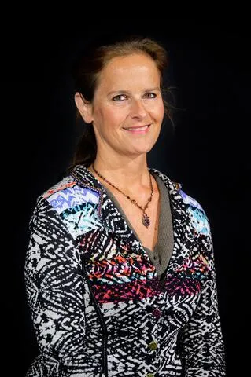

## Informations et Contact

 * **Email:** [isabelle.le_breton-falezan@sorbonne-universite.fr](mailto:isabelle.le_breton-falezan@sorbonne-universite.fr)
* **Profils:** [LinkedIn](https://www.linkedin.com/in/isabelle-le-breton-falezan-501a1a59) | [HAL](https://hal.science/search/index/?q=%2A&rows=30&authIdPerson_i=1149586&sort=publicationDate_tdate+desc)

## Activités scientifiques

 Colloques et journées d’étude :
24-25 sept. 2015 - Celsa - Colloque "Figures des décideurs en régime médiatique"  - Intervention : "Médiatisation télévisée d’une communication politique de crise : mises en scène de l’inflexibilité de Manuel Valls  aux JT de France 2 et de TF1".
22-24 juin 2015 - Aix en Provence - Congrès de l’AFSP - Co-organisation d’une Section thématique (ST 55) “La communication des organisations intergouvernementales”.
1 co-encadrement scientifique de Thèse (avec le professeur Yves Jeanneret) :
(2010-2015) : Celsa Paris-Sorbonne, Titre : “Représenter et incarner une organisation internationale. Analyse d’une prétention communicationnelle sur le site internet de l’UNESCO” - Auteur : Camille Rondot. Thèse soutenue le 13 septembre 201.5
2 autres participations à des jurys de Thèse :
octobre 2016 : Ecole doctorale de Sciences-Po Paris - Discipline : Sciences politiques - Titre : “ La communication à l'ONU” - Auteur : M. REGRAGUI Ismaël - Direction : professeur Guillaume Devin.
décembre 2017 : Ecole doctorale de l’Université Paris VII Denis Diderot - Discipline : SIC - Titre : “Continuité et rupture de la prégnance médiatique. La couverture de la Chine par le Monde diplomatique (1975-1992)”  - Auteur : M. Alexandre Schiele - Direction : professeure  Joëlle Le Marec.
Organisation de “Tables rondes” entre professionnels et universitaires. Un exemple :
13 juin 2017 : Celsa Sorbonne-Université - “L’Election présidentielle française” (avec Th. Devars, MCF Celsa)

## Expertises

 Les recherches et enseignements d’Isabelle Le Breton-Falézan se penchent sur la part prise par la communication dans l’institutionnalisation des acteurs (individuels ou collectifs, organisations, institutions..) qui évoluent dans l’espace public. Que celui-ci soit local, national ou international. Comment leur identité et leur autorité se construisent dans cet espace physique et médiatique, comment ils démontrent leur dimension agissante. Etant de formation juridique, puis politiste, il s’agit pour elle d’étudier ensemble trois registres interdépendants : le comportement de ces acteurs (faits de langage, représentations mentales..), la matérialité des dispositifs de communication qu’ils mobilisent et les logiques sociales et culturelles dans lesquels l’ensemble s’inscrit. La vie politique française constitue le champ désormais privilégié de ses activités. Par le passé, ce sont les organisations internationales qui ont inspiré le plus ses travaux, cours et présence dans des événements scientifiques.

## Thématiques de recherche

 La communication politique en France sous la Vème République. Approche socio-historique. Liens évolutifs entre le droit constitutionnel, la sociologie politique du régime, ET l’évolution des dispositifs d’information et communication.
La médiatisation télévisuelle du politique.
Plus largement toutes les constructions médiatiques du politique (y compris « journalistique »), les formes digitales de  la communication des acteurs et des instances politiques (en tension avec ses  persistances télévisuelles).
Les dispositifs et modes de médiation, de décision et de légitimation politiques
Crise, politique et communication.
Médiatisation de la scène internationale (via la politique étrangère de la France, les organisations internationales onusiennes, les conflits…).

