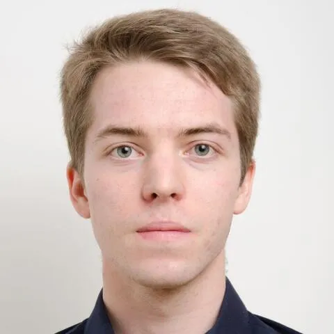

## Informations et Contact

 * **Profils:** [LinkedIn](https://www.linkedin.com/in/joachimfischer1/) | [HAL](https://hal.science/search/index/?q=%2A&rows=30&authIdPerson_i=1149867&sort=publicationDate_tdate+desc)

## Thématiques de recherche

 Anthropocène,
Bifurcation écologique,
Engagement,
Ingénieurs,
Référence.
Doctorat sur les discours écologiques en milieux de jeunes ingénieurs.
Sous la direction de Laurent Petit et Joëlle Le Marec.

