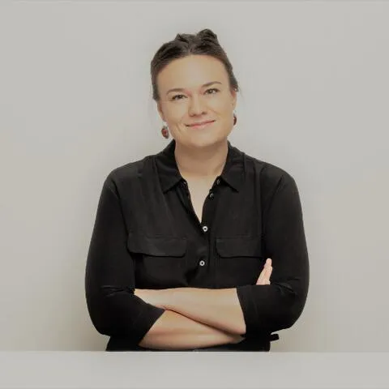

## Informations et Contact

 * **Email:** [marine.allein@club-internet.fr](mailto:marine.allein@club-internet.fr)

## Thématiques de recherche, expertises et enseignements

 Discipline
: Sciences de l'information et de la communication
Thématiques de recherche
: Enjeux de communication et relations de travail
Sujet de recherche
: Les enjeux symboliques et organisationnels de la communication portée par les managers : analyse des processus de circulation du discours communicationnel au sein des entreprises
Mots-clés
: Communication des organisations, management, rhétorique, éthique, communication managériale, jeux institutionnels, ...
Directeur de thèse
: Véronique Richard

