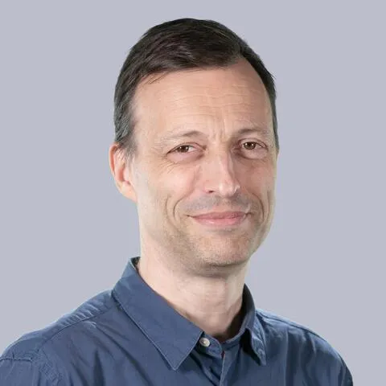

## Informations et Contact

 * **Email:** [pascal.froissart@sorbonne-universite.fr](mailto:pascal.froissart@sorbonne-universite.fr)
* **Profils:** [LinkedIn](https://www.linkedin.com/in/pascalfroissart/) | [HAL](https://hal.science/search/index/?q=%2A&rows=30&authIdPerson_i=660&sort=publicationDate_tdate+desc)
* **CV:** [Télécharger le CV](https://kit-117.sorbonne-universite.fr/sites/default/files/media/2022-09/froissart-publications-2022_0.pdf)

## Activités scientifiques

 Co-directeur de la collection « Médias »
, Presses universitaire de Vincennes

## Articles

 2022. « L’invention de la lutte contre les rumeurs ». Le temps des médias. Nº 38 (printemps-été)
2018 (en coll. avec Laurence Corroy). « L’éducation aux médias dans les discours des ministres de l’éducation, 2005-2017 ». Questions de communication. Nº 34 (décembre)
2014 (en coll. avec Aurélie Aubert), « Les publics de l’information », Revue française des sciences de l’information et de la communication. Nº 5 (« État des recherches en SIC sur l’information médiatique », Jacques Walter & Béatrice Fleury, coord.)
2011. « Mesure et démesure de l’emballement médiatique. Réflexions sur l’expertise en milieu journalistique ». MEI – Médiation et information. Nº 35 (« Scientisme(s) et communication », Aurélie Tavernier, coord.). Paris : L’harmattan, pp. 143-160
2010 (en coll. avec Joëlle Farchy). « Le marché de l’édition scientifique entre accès “propriétaire” et accès “libre” ». Hermès. Nº 57 (« Science.com », Joëlle Farchy et Cécile Méadel, coll.). Paris : CNRS Éditions, pp. 145-157
2010 (en coll. avec Joëlle Farchy et Cécile Méadel). « Introduction. Science.com ». Hermès. Nº 57 (« Science.com », Joëlle Farchy et Cécile Méadel, coll.). Paris : CNRS Éditions, pp. 9-12
2009 (en coll. avec Hélène Cardy). « French Scholars in “Information and Communication Studies” (1975–2008) ». Studies in Communication Sciences. Vol. 9, nº 2, pp. 271–289

## Chapitres d’ouvrage

 2020. « L’emballement médiatique, la rumeur et l’infox comme moyen de noyer le poisson en politique ». In Jean-François Marmion (coord.). Psychologie de la connerie en politique. Auxerre : Sciences humaines Éditions, pp.145-160
2020. « Trump to the media: Fake you! Analyse d’une communication polémique sur Twitter (2009-2018) », avec Laura Calabrese et Jeoffrey Gaspard. In Rosa Cetro & Lorella Sini (coord.). Fake news rumeurs, intox... Stratégies et visées discursives de la désinformation. Paris : L’Harmattan, coll. « Humanités numériques »
2019. « Vrai et faux en contexte médiatique. Fake news, infox, rumeur ». In Kintz, Salomé (coord.). Décoder l’information, combattre la désinformation en bibliothèque, Lyon : Presses de l’ENSSIB
2014. « “Esto no es un rumor”. Designación y ocultación de un fenómeno mediático ». In Rodríguez Infiesta, Víctor & Cindy Coignard (coord.) Las fuentes en la prensa : verdades, rumores y mentiras. Bordeaux : PILAR & U. Bordeaux-Montaigne, pp. 7-23
2018. « Rumeur ». Publictionnaire. Dictionnaire encyclopédique et critique des publics. Université de Lorraine & Centre de recherche sur les médiations (CREM)
2014. « Abondance et gratuité : pour quoi faire et jusqu’où ? Dominique Wolton, en entretien avec Joëlle Farchy, Pascal Froissart et Cécile Méadel ». In Valérie Schafer (coord.). Information et communication scientifiques à l’heure du numérique. Paris : CNRS Éditions, coll. « Les essentiels d’Hermès », pp. 31-47
2013. « SIC : cartographie d’une discipline ». In Stéphane Olivesi (coord.). Sciences de l’information et de la communication. Objets, savoirs, discipline. Grenoble : Presses de l’Université de Grenoble, pp. 269-292

## Communications et interventions

 2020. « Rumeur et lutte contre la rumeur ». Colloque international « Le discours de la rumeur à l’ère numérique », Agadir, du 8 au 10 juin 2021, le 9 juin
2018, « Rumeur : concept toujours réinventé, angoisses toujours renouvelées ». Fake news, rumeurs, intox… Stratégies et visées discursives de la désinformation. Université de Pise, 4 octobre
2011. « Media Studies in France (1975-2011) », conférence invitée au VIIe Congrès de la Société portugaise de communication (SOPCOM) sur « Meios Digitais e Indústrias Criativas », dans la session plénière « Da Ciência da Informação às Ciências da Comunicação-Questões para um Novo Paradigma », 16 décembre.
2010. « Is rumor media blinded? For a Critical Theory of Rumor ». Communication. « The Political and Social Impact of Rumours ». Université technologique de Singapour (« Nanyang »), Centre of Excellence for National Security (CENS), S. Rajaratnam School of International Studies (RSIS). 22 février
2010. « Le Web et l’opinion ». Conférence. De la démocratie en Internet. FondaPol, Fondation pour l’innovation politique, Grand palais de Lille (salle Turin). 27 mars
2018. « La rumeur peut-elle être créative ? La troublante similitude des dispositifs expérimentaux chez les psychologues et les créateurs littéraires ». In SFSIC (coord.). Création, créativité et médiations. Actes du XXIe Congrès de la SFSIC, 13-16 juin 2018 Paris (France)
2010. « L’emballement médiatique, diagnostic et syndrome. De l’impossibilité de nommer sans normer ». Communication. XVIIe Congrès de la Société française des Sciences de l’information et de la communication. Dijon, 23-26 juin

## Directions de dossiers

 2010. Hermès. Nº 57 (« Science.com. Libre accès et science ouverte », Joëlle Farchy et Cécile Méadel, coll.). Paris : CNRS Éditions.
2007. MédiaMorphoses. Nº 19 (« Médias, rumeurs, contes et faux-fuyants »). Paris : ina & Armand Colin

## Expertises

 Mes recherches portent sur les théories des médias, la diffusion des savoirs et des croyances, et l’histoire des idées et des institutions. J’aime assez travailler sur les concepts de viralité, de rumeur, de fact-checking, de masse…

## Ouvrages

 Pascal Froissart, L'invention du fact-checking : Enquête sur la « Clinique des rumeurs ». Boston, 1942-1943, Paris, Presses universitaires de France, 2024, 344 p.
Julia Bonaccorsi, Perrine Boutin, Étienne Candel, Pauline Escande-Gauquié, Pascal Froissart, Sarah Labelle, Claire Oger et Aude Seurrat (coord.), Écrire un mémoire en sciences de l'information et de la communication : Récits de cas, démarches et méthodes, Paris, Presses de la Sorbonne nouvelle, 2014, 169 p.
Pascal Froissart, La rumeur : Histoire et fantasmes, Paris, Belin, 2010 (1
re
éd. 2002), 356 p.

## Publications et communications

 Ouvrages
Pascal Froissart, L'invention du fact-checking : Enquête sur la « Clinique des rumeurs ». Boston, 1942-1943, Paris, Presses universitaires de France, 2024, 344 p.
Julia Bonaccorsi, Perrine Boutin, Étienne Candel, Pauline Escande-Gauquié, Pascal Froissart, Sarah Labelle, Claire Oger et Aude Seurrat (coord.), Écrire un mémoire en sciences de l'information et de la communication : Récits de cas, démarches et méthodes, Paris, Presses de la Sorbonne nouvelle, 2014, 169 p.
Pascal Froissart, La rumeur : Histoire et fantasmes, Paris, Belin, 2010 (1
re
éd. 2002), 356 p.
Directions de dossiers
2010. Hermès. Nº 57 (« Science.com. Libre accès et science ouverte », Joëlle Farchy et Cécile Méadel, coll.). Paris : CNRS Éditions.
2007. MédiaMorphoses. Nº 19 (« Médias, rumeurs, contes et faux-fuyants »). Paris : ina & Armand Colin
Chapitres d’ouvrage
2020. « L’emballement médiatique, la rumeur et l’infox comme moyen de noyer le poisson en politique ». In Jean-François Marmion (coord.). Psychologie de la connerie en politique. Auxerre : Sciences humaines Éditions, pp.145-160
2020. « Trump to the media: Fake you! Analyse d’une communication polémique sur Twitter (2009-2018) », avec Laura Calabrese et Jeoffrey Gaspard. In Rosa Cetro & Lorella Sini (coord.). Fake news rumeurs, intox... Stratégies et visées discursives de la désinformation. Paris : L’Harmattan, coll. « Humanités numériques »
2019. « Vrai et faux en contexte médiatique. Fake news, infox, rumeur ». In Kintz, Salomé (coord.). Décoder l’information, combattre la désinformation en bibliothèque, Lyon : Presses de l’ENSSIB
2014. « “Esto no es un rumor”. Designación y ocultación de un fenómeno mediático ». In Rodríguez Infiesta, Víctor & Cindy Coignard (coord.) Las fuentes en la prensa : verdades, rumores y mentiras. Bordeaux : PILAR & U. Bordeaux-Montaigne, pp. 7-23
2018. « Rumeur ». Publictionnaire. Dictionnaire encyclopédique et critique des publics. Université de Lorraine & Centre de recherche sur les médiations (CREM)
2014. « Abondance et gratuité : pour quoi faire et jusqu’où ? Dominique Wolton, en entretien avec Joëlle Farchy, Pascal Froissart et Cécile Méadel ». In Valérie Schafer (coord.). Information et communication scientifiques à l’heure du numérique. Paris : CNRS Éditions, coll. « Les essentiels d’Hermès », pp. 31-47
2013. « SIC : cartographie d’une discipline ». In Stéphane Olivesi (coord.). Sciences de l’information et de la communication. Objets, savoirs, discipline. Grenoble : Presses de l’Université de Grenoble, pp. 269-292
Articles
2022. « L’invention de la lutte contre les rumeurs ». Le temps des médias. Nº 38 (printemps-été)
2018 (en coll. avec Laurence Corroy). « L’éducation aux médias dans les discours des ministres de l’éducation, 2005-2017 ». Questions de communication. Nº 34 (décembre)
2014 (en coll. avec Aurélie Aubert), « Les publics de l’information », Revue française des sciences de l’information et de la communication. Nº 5 (« État des recherches en SIC sur l’information médiatique », Jacques Walter & Béatrice Fleury, coord.)
2011. « Mesure et démesure de l’emballement médiatique. Réflexions sur l’expertise en milieu journalistique ». MEI – Médiation et information. Nº 35 (« Scientisme(s) et communication », Aurélie Tavernier, coord.). Paris : L’harmattan, pp. 143-160
2010 (en coll. avec Joëlle Farchy). « Le marché de l’édition scientifique entre accès “propriétaire” et accès “libre” ». Hermès. Nº 57 (« Science.com », Joëlle Farchy et Cécile Méadel, coll.). Paris : CNRS Éditions, pp. 145-157
2010 (en coll. avec Joëlle Farchy et Cécile Méadel). « Introduction. Science.com ». Hermès. Nº 57 (« Science.com », Joëlle Farchy et Cécile Méadel, coll.). Paris : CNRS Éditions, pp. 9-12
2009 (en coll. avec Hélène Cardy). « French Scholars in “Information and Communication Studies” (1975–2008) ». Studies in Communication Sciences. Vol. 9, nº 2, pp. 271–289
Communications et interventions
2020. « Rumeur et lutte contre la rumeur ». Colloque international « Le discours de la rumeur à l’ère numérique », Agadir, du 8 au 10 juin 2021, le 9 juin
2018, « Rumeur : concept toujours réinventé, angoisses toujours renouvelées ». Fake news, rumeurs, intox… Stratégies et visées discursives de la désinformation. Université de Pise, 4 octobre
2011. « Media Studies in France (1975-2011) », conférence invitée au VIIe Congrès de la Société portugaise de communication (SOPCOM) sur « Meios Digitais e Indústrias Criativas », dans la session plénière « Da Ciência da Informação às Ciências da Comunicação-Questões para um Novo Paradigma », 16 décembre.
2010. « Is rumor media blinded? For a Critical Theory of Rumor ». Communication. « The Political and Social Impact of Rumours ». Université technologique de Singapour (« Nanyang »), Centre of Excellence for National Security (CENS), S. Rajaratnam School of International Studies (RSIS). 22 février
2010. « Le Web et l’opinion ». Conférence. De la démocratie en Internet. FondaPol, Fondation pour l’innovation politique, Grand palais de Lille (salle Turin). 27 mars
2018. « La rumeur peut-elle être créative ? La troublante similitude des dispositifs expérimentaux chez les psychologues et les créateurs littéraires ». In SFSIC (coord.). Création, créativité et médiations. Actes du XXIe Congrès de la SFSIC, 13-16 juin 2018 Paris (France)
2010. « L’emballement médiatique, diagnostic et syndrome. De l’impossibilité de nommer sans normer ». Communication. XVIIe Congrès de la Société française des Sciences de l’information et de la communication. Dijon, 23-26 juin

## Thématiques de recherche

 Théories des médias
Communication
journalisme
Télécharger le CV

