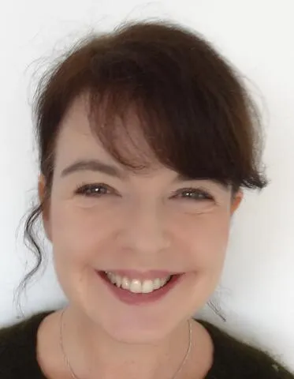

## Informations et Contact

 * **Email:** [pascalinefaure@orange.fr](mailto:pascalinefaure@orange.fr)
* **Profils:** [LinkedIn](https://www.linkedin.com/in/pascaline-faure-b1069921/) | [HAL](https://hal.science/search/index/?q=%2A&rows=30&authIdPerson_i=1121819&sort=publicationDate_tdate+desc)

## Expertises

 Directrice du Département d’anglais médical, Directrice de Recherche à l’Ecole Doctorale Concepts et Langages
Institution de rattachement :
Faculté de Santé de Sorbonne Université

## Thématiques de recherche

 Médiations marchandes

