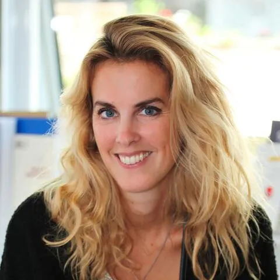

## Informations et Contact

 * **Email:** [pauline.escande-gauquie@sorbonne-universite.fr](mailto:pauline.escande-gauquie@sorbonne-universite.fr)
* **Profils:** [LinkedIn](https://www.linkedin.com/in/pauline-escande-gauquié-92224538/) | [HAL](https://hal.science/search/index/?q=pauline+escande&rows=30&sort=publicationDate_tdate+desc)

## Activités scientifiques

 Co-fondatrice
du
GER « recherche et création »
au sein de la SFSIC (2022- 2025)
> ACFAS Magazine, Enjeux de la recherche : recherche-création, 2018, en ligne :
https://www.acfas.ca/publications/magazine/enjeux-recherche/recherche-creation
Création et co-animation
du séminaire de recherche intitulé « Médiamorphoses » avec Valérie Jeanne-Perrier (2016-2025).
Le séminaire s’est construit pour l’instant autour des thématiques suivantes :
La thématique « Les émotions, les affects, le sensible (2024-2026)
La thématique « FRAMER (les français et la mer) » (2022-2024)
La thématique « Mode, médiatisations et médiations » (2018-2021)
La thématique « La photographie mobile » (2016-2018)
Projets de recherche
Membre
du Projet
DE FACTO II

## Articles

 Escande-Gauquié, P. (2025). La chronique numérique comme écriture. Le transmédia dans les industries culturelles et créatives. Approches théoriques et pratiques, Éditions Orbis Tertius.
Escande-Gauquié, P. (2024) et Feroc-Dumez, I. La Création du CLEMI Sup : la mise en œuvre d’une politique de médiation de la recherche en EMI face aux désordres informationnels. Politiques de communication, PUO.
Escande-Gauquié, P. (2024). Le podcast « Story » des Échos ou la parole donnée. Quaderni, Éditions FMSH.
Escande-Gauquié, P. (2021). Crise et cinéma, quel combat ? Théorème, Crise, quelle crise ? n°34, Éditions PSN, pp. 61-74.
Escande-Gauquié, P. (2019). Smartphone, réseaux sociaux et gestes performatifs. MEI, Harmattan, pp. 207-218.
Escande-Gauquié, P. (2018). L’art mobile comme un renouvellement de la photographie vernaculaire : nouvelles fictions ? Théorème, Enjeux artistiques et théoriques, n°29, Éditions PSN, pp. 153-164.
Escande-Gauquié, P. & Aim, 0. (2016). L’écranalyse ou la mise en réflexivité des écrans à l’ère de leur multiplication. Interfaces numériques, n°5, Éditions UL, pp. 129-147.
Escande-Gauquié, P. & Jeanne-Perrier, V. (2013). La photo mobile : les conditions d’émergence d’avant-gardes esthétiques au sein d’écosystèmes communicationnels réinventés. Interfaces numériques n°2, Éditions UL, pp. 313-336.
Escande-Gauquié, P. & Souchier E. (2011). Matières et supports, la bande dessinée dans tous ses états. Communication et langages, Bande dessinée : le pari de la matérialité, n°167, pp. 17-30.
Escande-Gauquié, P. (2009). La crise, les mots pour le dire. Communication et langages, Écrire la crise, n°162, pp. 67-74.
Escande-Gauquié, P. (2009). La BD un média capable de transformation : semblants de l’adaptation animée d’une bande dessinée ». Hermès, n°53, CNRS Éditions, pp. 53-62.
Escande-Gauquié, P. (2007). Cinéma d’auteur ou cinéma grand public : une contradiction française ? Communication et langages, n°153, pp. 19-30.

## Chapitres d’ouvrage

 Escande-Gauquié, P. (2024). Apoline ou une poétique ordinaire sur les réseaux sociaux. Extensions sémiotiques, Harmattan.
Escande-Gauquié, P. (2018). Le selfie à l’épreuve des écrans. in Selfie(s), Paris, Éditions Hermann, sous la direction de Bertrand Naivin, pp. 89-102.
Escande-Gauquié, P. & Jeanne-Perrier, V. (2018 ). Le Mook La revue dessinée. in Les Mooks, espace de renouveau du journalisme littéraire, Paris, Éditions l’Harmattan, sous la direction d’Audrey Alvès et Marieke Stein, pp. 101-120.
Escande-Gauquié, P. & Aim O. (2016). Éléments pour une écranalyse. Pratiques et réflexivité des pratiques d’écrans. in D’un écran à l’autre, les mutations du spectateur, Paris, L’Harmattan et Ina Éditions, sous la direction de Jean Châteauvet et Gilles Delavaud, pp. 111-122.
Escande-Gauquié, P. (2015). Le sens c’est par là. Manuel pédagogique Communication, Éditions Dunod, sous la direction de Olivier Aim et Stéphane Billiet, p. 110-112.
Escande-Gauquié, P. (2014). L’analyse sémiologique. Écrire un mémoire en Sciences de l’information et de la communication, Paris, Presses Sorbonne Nouvelle, sous la direction d’Aude Seurrat, pp. 83-86.
Escande-Gauquié, P. (2014). Les critiques de films du site Allociné. Sémiotique mode d’emploi, (dir.) Karine Berthelot-Guiet et Jean-Jacques Boutaud, Paris, Éditions Le bord de l’eau, pp. 101-130.
Escande-Gauquié, P. (2011). Du papier à l’écrit d’écran : l’IBooks. Le livre produit culturel, Paris, Editions Orizons, sous la direction de Gilles Pilizzi et Anne Réach-Ngô, pp. 301-3016.
Escande-Gauquié, P. & Mouratidou E. (2011). Sin city, de la bande dessinée au film. Parcours intersémiotiques, sous la direction de Anne Jaubert, Juan Lopez Munoz, Sophie Mariette, Laurence Rosier et Claire Stolz, Citations I, Citer à travers les formes. Intersémiotique de la Citation, n°2, Paris, L’Harmattan, , pp. 229-242.
Escande-Gauquié, P. (2008). Le blockbuster français : un oxymore ? Les Cultural Studies dans les mondes francophones. Précisions et imprécisions, conceptualisations. Ottawa, Éditions Lamacs, sous la direction de Boulou Ebada de B’béri, pp. 263-284.

## Communications avec Actes dans un congrès international ou national

 Escande-Gauquié, P. & Allard L. & Candel E. & Gomez-Mejia G. (2024). La recherche sur le numérique par la création , XXIème Congrès SFSIC : La numérisation des sociétés, Université de Bordeaux.
Escande-Gauquié, P. (2023). Comment les SIC ont nourri un point de vue sémiologique en recherche et création ?, Colloque international, De quoi sémio est-il le nom ? Université de Liège.
Escande-Gauquié, P. (2022). La chronique numérique comme recherche création : le cas de l’avatar Apoline , Colloque international Sémiotique de terrain, Université Paris 8.
Escande-Gauquié, P. (2021). La chronique numérique, objet de fiction hybride, XXème Congrès SFSIC : Sociétés et espaces en mouvements., Université de Grenoble.
Escande-Gauquié, P. & Aim, O. (2014). Éléments pour une écranalyse : pratiques et réflexivité des pratiques d’écrans, Colloque international D’un écran à l’autre : les mutations du spectateur, Université du Québec.
Escande-Gauquié, P. (2011). La neutralisation de rhétorique chez Barthes, Congrès de l’AISV-IASV - l’Association Internationale de sémiotique visuelle : Rhétorique du visible. Stratégies de l’image entre signification et communication, Université de Venise.
Escande-Gauquié, P. & Aim, O. (2011). Du fragment aux figures, Congrès de l’AFS - l’Association Française de Sémiotique, Université de Lyon.
Escande-Gauquié, P. & Mouratidou, E. (2010). Sin city, de la bande dessinée au film, IV e Colloque International du groupe Ci-dit (Circulations des discours), Université de Nice.
Escande-Gauquié, P. (2008). Le storybord comme l’histoire dessinée et destinée d’un film, 8e Colloque IAWIS/AIERTI - l'Association Internationale pour l'Étude des Rapports entre Texte et Image :"Éfficacité/Efficacy", EHESS.
Escande-Gauquié, P. (2008). Comment les SIC interagissent méthodologiquement avec les sciences du langage : illustration à travers la notion de trivialité, 16éme Congrès SFSIC, IUT de Compiègne.

## Communications sans actes dans un congrès international ou national (28)

 Escande-Gauquié, P. (2024). « Le Clemi Sup : partenariats, enjeux et perspectives », Symposium : Theory Practice Education , Université Aix/Marseille.
Escande-Gauquié P. (2024). « Enquêter par le proche ou en proximité », Cultures de l’enquête, approches qualitatives, Museum National d’Histoire Naturelle.
Escande-Gauquié, P. (2023). « Panorama des travaux en recherche et création », Journée d’étude : Recherche et création en SIC, INHA.
Escande-Gauquié, P. (2023). « Apoline ou comment nous avons l’art pour ne pas mourir de la vérité », Journée d’étude : Recherche et création, INHA.
Escande-Gauquié, P. (2023). « Introduction de la journée », Journée d’étude : Défense et illustration de la rechercher et création, Maison de la recherche, Sorbonne Université.
Escande-Gauquié, P. (2023), « Apoline et la chronique numérique », Journée d’étude : Transmédia et industries culturelles et créatives, Université Paris Cité.
Escande-Gauquié, P. (2023). « Enjeux de médiation et de médiatisation autour de la mer », Journée d’étude : Communiquer autour de la mer, Université de Aix-Marseille.
Escande-Gauquié, P. (2023). « Projet FRAMER : Les français et la mer, le cas des scolaires », Journée International de l’Institut de l’océan de Paris, Sorbonne Université.
Escande-Gauquié, P. (2023). « Enjeux de l’EMI », Journée d’étude international : L’éducation aux médias et à l'information sur tous les fronts, Université de la Sorbonne.
Escande-Gauquié, P. (2022). « Le selfie et l’insoutenable légèreté de l’être », Journée étude Circulation des émotions et des affects dans les réseaux sociaux et les espaces numériques, Université de Dijon.
Escande-Gauquié, P. (2021). « Introduction de la journée : la mode dans tous ses états ». Mode : Éthique, étiquette, étiquetage, Sorbonne Université.
Escande-Gauquié, P. (2021). « Le nom comme l’affirmation d’une auctorialité chez deux écrivaines françaises : George Sand et Colette », Au carrefour des sens – 5éme édition, Université de Lviv.
Escande-Gauquié, P. (2020). « Apoline ou la paratopie d’une chercheuse en SIC ». Pandemix, Université Paris 3.
Escande-Gauquié, P. (2019). « Jeux et enjeux littéraires chez des femmes écrivaines françaises ». Au carrefour des sens – 4éme édition de Wroclaw, Institut d’études Romanes.
Escande-Gauquié, P. (2018). « La proximité du chercheur à son terrain, vers une participation observante : enquête auprès des professionnels du cinéma français », Journée d’étude Cultures de l’enquête, Celsa Paris-Sorbonne.
Escande-Gauquié, P. (2018). « GAFAM et neutralité du net », Congrès du CLEMI Éducation aux médias, au Lab de l’éducation nationale.
Escande-Gauquié, P. (2018). « Des vies vécues, retours d’enquête dans le milieu du cinéma français », Colloque international IRCAV, Cinéma audiovisuel, nouveaux médias (22-23 novembre), Maison de la recherche Sorbonne Nouvelle.
Escande-Gauquié, P. (2018). « Les professionnels du cinéma français face la transformation numérique. Le cas Netflix ». Colloque international : La contagion créative. Médias, industries, récits, communautés, Université Panteion, Athènes.
Escande-Gauquié, P. (2018). « From the little story to the big History : snapchat», AMIR retreat 2018, Université de Thessalonique.
Escande-Gauquié, P. (2014), « La photographie mobile, un art « vernaculaire » en processus d’artification ». Colloque international Art et Mobiles, Université Paris 3, INHA.
Escande-Gauquié, P. & Mouratidou E. (2013). « De la BD au film, histoires médiagéniques de deux adaptations » La bande dessinée et les adaptations de la page à l’écran, Centre Interlangues Texte, Image, Langage de l’Université de Bourgogne.
2.4. Communications orales sans actes dans des séminaires de recherche
Escande-Gauquié, P. (2023). « Médiations muséales autour de la mer », Séminaire Médiamorphoses, GRIPIC, Celsa, IMSIC, Université de Aix-Marseille.
Escande-Gauquié, P. (2021). « Les maisons d'écrivaines comme dispositif d'écriture de l’intime », Séminaire du GRIPIC, Sorbonne Université, Celsa.
Escande-Gauquié, P. (2021). « De l’intertexte à la médiamorphose, retour sur des concepts ». Séminaire Médiamorphoses, Sorbonne Université, Celsa.
Escande-Gauquié, P. (2020), « Enquêter en proximité : de l’observation participante à la participation observante », Séminaire doctoral du GRIPIC, Sorbonne Université, Celsa.
Escande-Gauquié, P. (2020). « Le geste performatif sur les réseaux sociaux : de la pratique sémio-technique à la stratégie de communication », Séminaire Humanités Numériques, Université Paris 1, École des Arts de la Sorbonne. `
Escande-Gauquié, P. (2019). « Fernando Pessoa et le livre de l’intranquilité : quelles leçons en tirer dans la réflexivité du chercheur sur son travail de recherche », Séminaire Cultures de l’enquête, Sorbonne Université, Celsa.
Escande-Gauquié, P. (2017). « Sociologie de la culture : Jean Davallon », Séminaire Cultures et savoirs, Sorbonne Université, Celsa.
Escande-Gauquié, P. (2011), « Le cinéma français contemporain, retour d’enquête et état des lieux », Séminaire Cinéma, audiovisuel et innovation, intitulée Paris INHA.
Escande-Gauquié, P. (2010), « Genette et le cinéma », Séminiare Médias et sociétés, Université Paris 3.
Escande-Gauquié, P. (2009) « Parcours intersémiotiques » Groupe Critique génétique des arts visuels, ENS Paris.

## Direction d’ouvrages

 Escande-Gauquié, P. & Naivin, B. (2019). Comprendre la culture numérique, Paris, Editions Dunod.
Escande-Gauquié, P. & Jeanne-Perrier, V. (2021). Médiatisations de mode, Paris, Academia, L’Harmattan, coll. Extensions sémiotiques.

## Directions de dossiers

 Escande-Gauquié, P. & Pauline, Brouard, P. (2023). « L’enquête par le proche dans les SIC », Communication et langages, n°206.
Escande-Gauquié, P. & Jeanne-Perrier, V. (2017). « Le partage photographique : le régime performatif de la photo », Communication et langages, n°194.
Escande-Gauquié, P. & Souchier, E. (2011). « Matières et supports, la bande dessinée dans tous ses états », Communication et langages, n°167.

## Expertises

 Mes recherches questionnent les enjeux des acteurs professionnels au sein des organisations culturelles et de manière plus ouverte au sein des médias. Depuis ma délégation au CLEMI elle se sont orientées vers l’éducation aux médias et à l’information (EMI). Elles sont ancrées dans une démarche pluridisciplinaire : la méthode sémiologique articulée à l’enquête qualitative.

## Invitations dans en tant que conférencière plénière dans des universités étrangères

 Escande-Gauquié, P. (2023). « Semio-discursive perspectives : productions focusing on climate », Climate, Media and Public, IAMCR.
Escande-Gauquié, P. (2018). « Social media, branding and selfbranding ». 6th International Conférence on business, economics, marketing and management research, Université de Sousse, Tunisie.
Escande-Gauquié, P. (2015). « Traits, fragments, figures chez Roland Barthes », Colloque international de Wroclaw, Institut d’études Romanes.
Escande-Gauquié, P. (2014). « Le cinéma français crève l’écran », Centre for Cultural Policy Research, Université de Glasgow.

## Ouvrages individuels de valorisation de la recherche

 Escande-Gauquié, P. & Naivin, B. (2018). Les monstres 2.0, l’autre visage des réseaux sociaux, Paris, Éditions François Bourin.
Escande-Gauquié, P. (2015). Tous selfie ? Paris, Éditions François Bourin.

## Ouvrages individuels scientifiques

 Escande-Gauquié, P. (2021). Les défis numériques du cinéma français contemporain, Paris, Atlande.
Escande-Gauquié, P. (2012). Le cinéma français crève l’écran, pour en finir avec la crise du cinéma français, Paris, Atlande.

## Projets de recherche

 Membre
du Projet
DE FACTO II

## Publications et communications

 Ouvrages
Direction d’ouvrages
Escande-Gauquié, P. & Naivin, B. (2019). Comprendre la culture numérique, Paris, Editions Dunod.
Escande-Gauquié, P. & Jeanne-Perrier, V. (2021). Médiatisations de mode, Paris, Academia, L’Harmattan, coll. Extensions sémiotiques.
Ouvrages individuels scientifiques
Escande-Gauquié, P. (2021). Les défis numériques du cinéma français contemporain, Paris, Atlande.
Escande-Gauquié, P. (2012). Le cinéma français crève l’écran, pour en finir avec la crise du cinéma français, Paris, Atlande.
Ouvrages individuels de valorisation de la recherche
Escande-Gauquié, P. & Naivin, B. (2018). Les monstres 2.0, l’autre visage des réseaux sociaux, Paris, Éditions François Bourin.
Escande-Gauquié, P. (2015). Tous selfie ? Paris, Éditions François Bourin.
Directions de dossiers
Escande-Gauquié, P. & Pauline, Brouard, P. (2023). « L’enquête par le proche dans les SIC », Communication et langages, n°206.
Escande-Gauquié, P. & Jeanne-Perrier, V. (2017). « Le partage photographique : le régime performatif de la photo », Communication et langages, n°194.
Escande-Gauquié, P. & Souchier, E. (2011). « Matières et supports, la bande dessinée dans tous ses états », Communication et langages, n°167.
Chapitres d’ouvrage
Escande-Gauquié, P. (2024). Apoline ou une poétique ordinaire sur les réseaux sociaux. Extensions sémiotiques, Harmattan.
Escande-Gauquié, P. (2018). Le selfie à l’épreuve des écrans. in Selfie(s), Paris, Éditions Hermann, sous la direction de Bertrand Naivin, pp. 89-102.
Escande-Gauquié, P. & Jeanne-Perrier, V. (2018 ). Le Mook La revue dessinée. in Les Mooks, espace de renouveau du journalisme littéraire, Paris, Éditions l’Harmattan, sous la direction d’Audrey Alvès et Marieke Stein, pp. 101-120.
Escande-Gauquié, P. & Aim O. (2016). Éléments pour une écranalyse. Pratiques et réflexivité des pratiques d’écrans. in D’un écran à l’autre, les mutations du spectateur, Paris, L’Harmattan et Ina Éditions, sous la direction de Jean Châteauvet et Gilles Delavaud, pp. 111-122.
Escande-Gauquié, P. (2015). Le sens c’est par là. Manuel pédagogique Communication, Éditions Dunod, sous la direction de Olivier Aim et Stéphane Billiet, p. 110-112.
Escande-Gauquié, P. (2014). L’analyse sémiologique. Écrire un mémoire en Sciences de l’information et de la communication, Paris, Presses Sorbonne Nouvelle, sous la direction d’Aude Seurrat, pp. 83-86.
Escande-Gauquié, P. (2014). Les critiques de films du site Allociné. Sémiotique mode d’emploi, (dir.) Karine Berthelot-Guiet et Jean-Jacques Boutaud, Paris, Éditions Le bord de l’eau, pp. 101-130.
Escande-Gauquié, P. (2011). Du papier à l’écrit d’écran : l’IBooks. Le livre produit culturel, Paris, Editions Orizons, sous la direction de Gilles Pilizzi et Anne Réach-Ngô, pp. 301-3016.
Escande-Gauquié, P. & Mouratidou E. (2011). Sin city, de la bande dessinée au film. Parcours intersémiotiques, sous la direction de Anne Jaubert, Juan Lopez Munoz, Sophie Mariette, Laurence Rosier et Claire Stolz, Citations I, Citer à travers les formes. Intersémiotique de la Citation, n°2, Paris, L’Harmattan, , pp. 229-242.
Escande-Gauquié, P. (2008). Le blockbuster français : un oxymore ? Les Cultural Studies dans les mondes francophones. Précisions et imprécisions, conceptualisations. Ottawa, Éditions Lamacs, sous la direction de Boulou Ebada de B’béri, pp. 263-284.
Articles
Escande-Gauquié, P. (2025). La chronique numérique comme écriture. Le transmédia dans les industries culturelles et créatives. Approches théoriques et pratiques, Éditions Orbis Tertius.
Escande-Gauquié, P. (2024) et Feroc-Dumez, I. La Création du CLEMI Sup : la mise en œuvre d’une politique de médiation de la recherche en EMI face aux désordres informationnels. Politiques de communication, PUO.
Escande-Gauquié, P. (2024). Le podcast « Story » des Échos ou la parole donnée. Quaderni, Éditions FMSH.
Escande-Gauquié, P. (2021). Crise et cinéma, quel combat ? Théorème, Crise, quelle crise ? n°34, Éditions PSN, pp. 61-74.
Escande-Gauquié, P. (2019). Smartphone, réseaux sociaux et gestes performatifs. MEI, Harmattan, pp. 207-218.
Escande-Gauquié, P. (2018). L’art mobile comme un renouvellement de la photographie vernaculaire : nouvelles fictions ? Théorème, Enjeux artistiques et théoriques, n°29, Éditions PSN, pp. 153-164.
Escande-Gauquié, P. & Aim, 0. (2016). L’écranalyse ou la mise en réflexivité des écrans à l’ère de leur multiplication. Interfaces numériques, n°5, Éditions UL, pp. 129-147.
Escande-Gauquié, P. & Jeanne-Perrier, V. (2013). La photo mobile : les conditions d’émergence d’avant-gardes esthétiques au sein d’écosystèmes communicationnels réinventés. Interfaces numériques n°2, Éditions UL, pp. 313-336.
Escande-Gauquié, P. & Souchier E. (2011). Matières et supports, la bande dessinée dans tous ses états. Communication et langages, Bande dessinée : le pari de la matérialité, n°167, pp. 17-30.
Escande-Gauquié, P. (2009). La crise, les mots pour le dire. Communication et langages, Écrire la crise, n°162, pp. 67-74.
Escande-Gauquié, P. (2009). La BD un média capable de transformation : semblants de l’adaptation animée d’une bande dessinée ». Hermès, n°53, CNRS Éditions, pp. 53-62.
Escande-Gauquié, P. (2007). Cinéma d’auteur ou cinéma grand public : une contradiction française ? Communication et langages, n°153, pp. 19-30.
Communications et interventions
Invitations dans en tant que conférencière plénière dans des universités étrangères
Escande-Gauquié, P. (2023). « Semio-discursive perspectives : productions focusing on climate », Climate, Media and Public, IAMCR.
Escande-Gauquié, P. (2018). « Social media, branding and selfbranding ». 6th International Conférence on business, economics, marketing and management research, Université de Sousse, Tunisie.
Escande-Gauquié, P. (2015). « Traits, fragments, figures chez Roland Barthes », Colloque international de Wroclaw, Institut d’études Romanes.
Escande-Gauquié, P. (2014). « Le cinéma français crève l’écran », Centre for Cultural Policy Research, Université de Glasgow.
Communications avec Actes dans un congrès international ou national
Escande-Gauquié, P. & Allard L. & Candel E. & Gomez-Mejia G. (2024). La recherche sur le numérique par la création , XXIème Congrès SFSIC : La numérisation des sociétés, Université de Bordeaux.
Escande-Gauquié, P. (2023). Comment les SIC ont nourri un point de vue sémiologique en recherche et création ?, Colloque international, De quoi sémio est-il le nom ? Université de Liège.
Escande-Gauquié, P. (2022). La chronique numérique comme recherche création : le cas de l’avatar Apoline , Colloque international Sémiotique de terrain, Université Paris 8.
Escande-Gauquié, P. (2021). La chronique numérique, objet de fiction hybride, XXème Congrès SFSIC : Sociétés et espaces en mouvements., Université de Grenoble.
Escande-Gauquié, P. & Aim, O. (2014). Éléments pour une écranalyse : pratiques et réflexivité des pratiques d’écrans, Colloque international D’un écran à l’autre : les mutations du spectateur, Université du Québec.
Escande-Gauquié, P. (2011). La neutralisation de rhétorique chez Barthes, Congrès de l’AISV-IASV - l’Association Internationale de sémiotique visuelle : Rhétorique du visible. Stratégies de l’image entre signification et communication, Université de Venise.
Escande-Gauquié, P. & Aim, O. (2011). Du fragment aux figures, Congrès de l’AFS - l’Association Française de Sémiotique, Université de Lyon.
Escande-Gauquié, P. & Mouratidou, E. (2010). Sin city, de la bande dessinée au film, IV e Colloque International du groupe Ci-dit (Circulations des discours), Université de Nice.
Escande-Gauquié, P. (2008). Le storybord comme l’histoire dessinée et destinée d’un film, 8e Colloque IAWIS/AIERTI - l'Association Internationale pour l'Étude des Rapports entre Texte et Image :"Éfficacité/Efficacy", EHESS.
Escande-Gauquié, P. (2008). Comment les SIC interagissent méthodologiquement avec les sciences du langage : illustration à travers la notion de trivialité, 16éme Congrès SFSIC, IUT de Compiègne.
Communications sans actes dans un congrès international ou national (28)
Escande-Gauquié, P. (2024). « Le Clemi Sup : partenariats, enjeux et perspectives », Symposium : Theory Practice Education , Université Aix/Marseille.
Escande-Gauquié P. (2024). « Enquêter par le proche ou en proximité », Cultures de l’enquête, approches qualitatives, Museum National d’Histoire Naturelle.
Escande-Gauquié, P. (2023). « Panorama des travaux en recherche et création », Journée d’étude : Recherche et création en SIC, INHA.
Escande-Gauquié, P. (2023). « Apoline ou comment nous avons l’art pour ne pas mourir de la vérité », Journée d’étude : Recherche et création, INHA.
Escande-Gauquié, P. (2023). « Introduction de la journée », Journée d’étude : Défense et illustration de la rechercher et création, Maison de la recherche, Sorbonne Université.
Escande-Gauquié, P. (2023), « Apoline et la chronique numérique », Journée d’étude : Transmédia et industries culturelles et créatives, Université Paris Cité.
Escande-Gauquié, P. (2023). « Enjeux de médiation et de médiatisation autour de la mer », Journée d’étude : Communiquer autour de la mer, Université de Aix-Marseille.
Escande-Gauquié, P. (2023). « Projet FRAMER : Les français et la mer, le cas des scolaires », Journée International de l’Institut de l’océan de Paris, Sorbonne Université.
Escande-Gauquié, P. (2023). « Enjeux de l’EMI », Journée d’étude international : L’éducation aux médias et à l'information sur tous les fronts, Université de la Sorbonne.
Escande-Gauquié, P. (2022). « Le selfie et l’insoutenable légèreté de l’être », Journée étude Circulation des émotions et des affects dans les réseaux sociaux et les espaces numériques, Université de Dijon.
Escande-Gauquié, P. (2021). « Introduction de la journée : la mode dans tous ses états ». Mode : Éthique, étiquette, étiquetage, Sorbonne Université.
Escande-Gauquié, P. (2021). « Le nom comme l’affirmation d’une auctorialité chez deux écrivaines françaises : George Sand et Colette », Au carrefour des sens – 5éme édition, Université de Lviv.
Escande-Gauquié, P. (2020). « Apoline ou la paratopie d’une chercheuse en SIC ». Pandemix, Université Paris 3.
Escande-Gauquié, P. (2019). « Jeux et enjeux littéraires chez des femmes écrivaines françaises ». Au carrefour des sens – 4éme édition de Wroclaw, Institut d’études Romanes.
Escande-Gauquié, P. (2018). « La proximité du chercheur à son terrain, vers une participation observante : enquête auprès des professionnels du cinéma français », Journée d’étude Cultures de l’enquête, Celsa Paris-Sorbonne.
Escande-Gauquié, P. (2018). « GAFAM et neutralité du net », Congrès du CLEMI Éducation aux médias, au Lab de l’éducation nationale.
Escande-Gauquié, P. (2018). « Des vies vécues, retours d’enquête dans le milieu du cinéma français », Colloque international IRCAV, Cinéma audiovisuel, nouveaux médias (22-23 novembre), Maison de la recherche Sorbonne Nouvelle.
Escande-Gauquié, P. (2018). « Les professionnels du cinéma français face la transformation numérique. Le cas Netflix ». Colloque international : La contagion créative. Médias, industries, récits, communautés, Université Panteion, Athènes.
Escande-Gauquié, P. (2018). « From the little story to the big History : snapchat», AMIR retreat 2018, Université de Thessalonique.
Escande-Gauquié, P. (2014), « La photographie mobile, un art « vernaculaire » en processus d’artification ». Colloque international Art et Mobiles, Université Paris 3, INHA.
Escande-Gauquié, P. & Mouratidou E. (2013). « De la BD au film, histoires médiagéniques de deux adaptations » La bande dessinée et les adaptations de la page à l’écran, Centre Interlangues Texte, Image, Langage de l’Université de Bourgogne.
2.4. Communications orales sans actes dans des séminaires de recherche
Escande-Gauquié, P. (2023). « Médiations muséales autour de la mer », Séminaire Médiamorphoses, GRIPIC, Celsa, IMSIC, Université de Aix-Marseille.
Escande-Gauquié, P. (2021). « Les maisons d'écrivaines comme dispositif d'écriture de l’intime », Séminaire du GRIPIC, Sorbonne Université, Celsa.
Escande-Gauquié, P. (2021). « De l’intertexte à la médiamorphose, retour sur des concepts ». Séminaire Médiamorphoses, Sorbonne Université, Celsa.
Escande-Gauquié, P. (2020), « Enquêter en proximité : de l’observation participante à la participation observante », Séminaire doctoral du GRIPIC, Sorbonne Université, Celsa.
Escande-Gauquié, P. (2020). « Le geste performatif sur les réseaux sociaux : de la pratique sémio-technique à la stratégie de communication », Séminaire Humanités Numériques, Université Paris 1, École des Arts de la Sorbonne. `
Escande-Gauquié, P. (2019). « Fernando Pessoa et le livre de l’intranquilité : quelles leçons en tirer dans la réflexivité du chercheur sur son travail de recherche », Séminaire Cultures de l’enquête, Sorbonne Université, Celsa.
Escande-Gauquié, P. (2017). « Sociologie de la culture : Jean Davallon », Séminaire Cultures et savoirs, Sorbonne Université, Celsa.
Escande-Gauquié, P. (2011), « Le cinéma français contemporain, retour d’enquête et état des lieux », Séminaire Cinéma, audiovisuel et innovation, intitulée Paris INHA.
Escande-Gauquié, P. (2010), « Genette et le cinéma », Séminiare Médias et sociétés, Université Paris 3.
Escande-Gauquié, P. (2009) « Parcours intersémiotiques » Groupe Critique génétique des arts visuels, ENS Paris.

## Thématiques de recherche

 Les mutations des industries culturelles et médiatiques en contexte numérique
L’éducation aux médias et à l’information
Les identité(s) numérique(s) et pratiques des utilisateurs sur les dispositifs numériques
La recherche et création en terrain numérique

