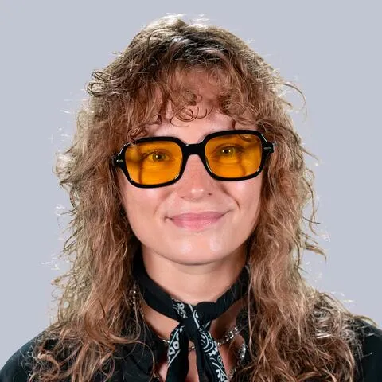

## Informations et Contact

 * **Email:** [Priscille.atteleyn@gmail.com](mailto:Priscille.atteleyn@gmail.com)
* **Profils:** [LinkedIn](https://www.linkedin.com/in/priscille-atteleyn/)

## Thématiques de recherche

 Production des discours marchands sur la mode responsable
Sémio-éthnographie de la circulation du vêtement de seconde main
Approche critique de la consommation en milieu anthropocène
Direction de thèse
: Caroline Marti

