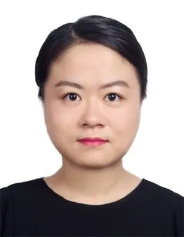

## Informations et Contact

 * **Email:** [qiwang.sorbonne@gmail.com](mailto:qiwang.sorbonne@gmail.com)

## Activités scientifiques

 The Challenges and Prospect of Data Sovereignty：Comparison between the General Data Protection Regulation of the EU and the Cyber Security Law of the People’s Republic of China
, session de Global Media Policy Working Group, IAMCR en ligne, 12-17 juin, 2020.

## Expertises

 Je m'intéresse aux différentes expressions sur des réseaux sociaux dans les cultures orientales et occidentales, surtout à l’expression et ses évolutions sur des réseaux sociaux en Chine. Je m’interroge sur les raisons pour lesquelles le changement s’est produit. Ma thèse en cours de préparation s’intitule :
L’énonciation de l’ironie sur les réseaux sociaux en Chine : WeChat comme exemple central d’une prudence dans la communication
.

