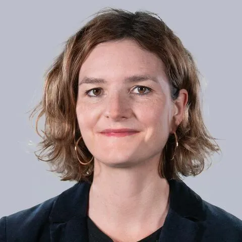

## Informations et Contact

 * **Email:** [sophie.corbille@sorbonne-universite.fr](mailto:sophie.corbille@sorbonne-universite.fr)
* **Profils:** [LinkedIn](https://www.linkedin.com/in/sophie-corbill%C3%A9-353a0992) | [HAL](https://hal.science/search/index/?q=%2A&rows=30&authIdPerson_i=1149569&sort=publicationDate_tdate+desc) | [Twitter](https://x.com/SophieCorbille)
* **CV:** [Télécharger le CV](https://kit-117.sorbonne-universite.fr/sites/default/files/media/2022-03/gripic-CV-sophie-corbille-2022.pdf)

## Autres activités scientifiques

 COM : communications orales sans acte dans un congrès international ou national
S. Corbillé, « Industrie culturelle de l’enfance et mondialisation des formes du jouer », XXVème colloque franco-roumain en sciences de l’information et de la communication, « Mondialisation de la communication : la diversité des cultures en questions », Iasi, Roumanie, 26-28 mai 2022.
S. Corbillé, 2021 « Conclusion », Colloque « Enfance et histoire : cultures et pratiques enfantines du passé » (org : E. Fantin et J. Tassel), Gripic, en ligne, 9 avril.
S. Corbillé, 2019, « Le goût des échanges. Donner, vendre et garder pour faire quartier, ensemble et séparés », 1er Congrès d’AnthropoVilles « Ce que l’anthropologie fait à la ville et ce que la ville fait à l’anthropologie », Lille, MESHS, 8 novembre.
S. Corbillé et E. Fantin, 2019, « Découvertes et explorations animales : représentations, mises en scène et discours sur les animaux dans les Expositions Universelles (1851-1867) », Colloque « Découvertes et explorations », XVIIème colloque annuel de la Society of Dix-Neuviémistes, Southampton, Grande-Bretagne, 9 avril.
S. Corbillé et E. Fantin, 2018, « Apparitions parisiennes. Récits médiatiques de l’Exposition universelle de 1855 dans La Presse », Colloque « Paris, capital(e) médiatique XIXe-XXIe siècles. Lieux, modèles et figures des médias, de Girardin aux start-ups », Sorbonne Université, Paris, 28 juin.
S. Corbillé, 2017, « La passion des échanges. Donner, vendre et garder pour faire quartier, ensemble et séparés, dans les quartiers gentrifiés parisiens », Colloque « Le lien social au regard de la circulation des biens, des personnes et des capitaux », Chaire Singleton, Université Catholique de Louvain, 3-4-5 mai.
S. Corbillé, 2016, « 'L'est de Paris c'est boboland.' Ce que la mode fait aux identités citadines et au territoire ou la fabrique du 'Paris branché' », colloque « Mode & frontières. Identités, cultures et territoires », Université de la Mode, Université Lumière Lyon 2, 9 février.
S. Corbillé et J. Tassel, 2015, « Patrons, au travail ! La téléréalité comme dispositif de médiatisation et de communication du patron-entrepreneur », Colloque « Figures des décideurs en régime médiatique. Représenter la décision politique et économique : un défi communicationnel » (programme de recherche DEFI), CELSA/GRIPIC, Université Paris-Sorbonne, 25 septembre.
S. Corbillé, 2011, « Vivre à Paris et être un Parisien », colloque de l’Association française d’ethnologie et d’anthropologie (AFEA), Atelier « Une anthropologie de Paris est-elle possible ? », Paris, 21 septembre.
S. Chevalier, S. Corbillé et E. Lallement, 2011, « Expérience de la globalisation en milieu urbain : le phénomène de la résidence secondaire à Paris et de la citadinité par intermittence », colloque de l’association française d’ethnologie et d’anthropologie (AFEA), Atelier « Villes et citadins dans la globalisation », Paris, 22 septembre.
S. Chevalier, S. Corbillé et E. Lallement, 2010, « Paris: a city of holiday flats? », conference of the American Association of Anthropology (AAA), Nouvelle-Orléans, EU, 17 novembre.
S. Chevalier, S. Corbillé et E. Lallement, 2009, « On origins, authenticity and ethical life: new urban values in Paris », conference of the american Association of Anthropology (AAA), Philadelphie, EU, 4 novembre.
S. Corbillé, 2007, « ‘I don’t want to play the native!’ Tourism, ethnology and organisation of social and symbolic relations in gentrified neighbourhoods of Eastern Paris. », Conference of the Association of Social Anthropologist of the UK and Commonwealth (ASA), « Thinking Through Tourism », London Metropolitain University, Grande-Bretagne, 12 avril.
S. Corbillé, 2005, « Quand le marchand fait quartier », Congrès latino-américain d’anthropologie organisé par l’Association latino-américaine d’anthropologie (ALA), Université de Rosario, Argentine, 14 juillet.
S. Corbillé et E. Lallement, 2005, « Commerces et formes de citadinité. Approche comparée de deux situations parisiennes d’échange marchand », Conférence internationale « Les villes comme tissu social. Fragmentation et intégration », organisée par l’Association internationale de sociologie, RC21, Science po Paris, 1er juillet.
S. Corbillé, 2004, « La ville à travers les espaces marchands : anthropologie comparée des situations d’échange marchand », Colloque de clôture de l’Action-Concertée Villes (ministère de la Recherche), Paris, 1er mars.
INV : conférences invitées dans un congrès national ou international, dans un séminaire de recherche
Journées d’études
J. Charbonneau, S. Corbillé et P. Froissart, 2022, « How "populism" made its way into media discourses. A French and British comparison – 2000/2022 », journée d’études « Authoritarian populism and Media » (or. S. Celenk), GRIPIC/Sorbonne Université, Paris, 30 juin.
S. Corbillé et E. Fantin, 2020, « Enquête sur les salons animaliers. Figures des chiens et ambivalences des relations hommes-canidés », Journées de chiens, Université de Limoges, Angoulême, 2 juillet.
S. Corbillé, 2017, « Enquêter en contexte saturé : stéréotypes, styles de vie et styles », journée d’études « Cultures de l’enquête » (org. par J. Le Marec), GRIPIC, Paris, 24 avril.
S. Corbillé et J. Tassel, 2015, « L'assiette et le champ. La gastronomie parisienne, le terroir d'île-de-France et le Grand Paris », journée d'études « Le Grand Paris qui mange » (org. par D. Pagès et G. Fumey), GRIPIC/ISCC, Université Paris-Sorbonne, 26 novembre.
S. Corbillé, 2012, « La marque Abou Dhabi comme opérateur de patrimoine », journée d’études « Mise en jeu du patrimoine dans la configuration de la ville aujourd’hui » (org. par C. de Saint-Pierre), Iris, EHESS, Paris, 15 juin.
S. Corbillé, 2010, « Qu’échange-t-on dans un vide-grenier de quartier ? De la place marchande à la communauté des locaux », journée d’études « Places marchandes » (org. par M.-F. Garcia), EHESS, Paris, 16 septembre.
S. Corbillé et E. Bajolet, 2004, « Mondes urbains ? Essai d’application du concept de monde aux espaces urbains », journée d’études « Questions à Howard Becker » (org. par M. de La Pradelle et C. Choron-Baix), GTMS, EHESS et LAU, CNRS, Paris, 14 mai.
S. Corbillé et E. Lallement, 2004, « L’effet de l’objet : ce qui l’anime et ce qu’il anime. Exemple de la maison », journée d’études « Questions à Howard Becker » (org. par M. de La Pradelle et C. Choron-Baix), GTMS, EHESS et LAU, CNRS, Paris, 14 mai.
S. Corbillé, 2003, « Les processus de production d’un nouveau territoire, l’Est parisien “attractif” », journée d’études « Etudes urbaines », Centre de Recherches Historiques et PRI Etudes Urbaines, EHESS, 20 janv.
Séminaires de recherche
S. Corbillé et E. Fantin, 2021, « Petite zoosémiotique des salons animaliers. Spectacles et actantialités des animaux exposés », Greimas, Paris, 26 mai.
S. Corbillé, 2019, « Troubles dans le jeu : marques et publicités au cœur d’un parc d’attraction pour enfants », Séminaire « Médiations marchandes », GRIPIC, 4 juin.
S. Corbillé et E. Fantin, 2018, « Les circonvolutions d’une réclame : George Sand, La Presse et la faïence », séminaire « Girardin » (programme de recherche Giranium, dir. par A. Wrona), GRIPIC, 22 mars.
S. Corbillé, 2018, « Trouble dans le jeu. Marques et publicités au cœur d’un parc d’attraction pour enfants », séminaire international « Transformations des prises de parole de marques : numératie publicitaire, genres et générations, approches internationales » (org. K. Berthelot-Guiet et C. Marti), GRIPIC/Sorbonne Université, 26 juin.
S. Corbillé, 2017, « Le travail au prisme du don », séminaire « Travail et goût » (org. Par D. Ruellan), GRIPIC, 4 décembre.
S. Corbillé, 2017, « Le « bobo » dans sa vi(ll)e. Type, stéréotype et style de vie, ou l’exploration des liens entre mode, ville et existence », séminaire « Mode et médias » (org. par V.J Perrier et P. Gauquié), GRIPIC, 27 septembre.
S. Corbillé, 2017, « Le Paris de Girardin », séminaire « Girardin » (programme de recherche Giranium, dir. par A. Wrona), GRIPIC, 27 mars.
S. Corbillé, 2016, « Diseno urbano, communicación y economía del renombre », seminario del Magister del INVI, FAU, Universidad de Chile, Santiago, Chili, 27 mai.
S. Chevalier, S. Corbillé, E. Lallement, 2013, « La ville comme résidence secondaire. Paradoxes de l’attractivité parisienne dans le contexte de la mondialisation », séminaire « Frontières et mouvements de la vile » (org. par M. Agier et A. Raulin), IACC, EHESS, Paris, 18 avril.
S. Corbillé, 2011, « Espaces marchands, nouvelles classes moyennes et supérieures et gentrification. Les régimes d’altérité dans les quartiers du nord-est de Paris », séminaire du GRIPIC, 6 mai.
S. Corbillé, 2010, « Dimensions matérielles et symboliques de la fabrique du lieu dans les quartiers gentrifiés du nord-est de Paris », séminaire « Faire lieu » (C. Choron-Baix et S. Gravereau), Laboratoire d’anthropologie urbaine (LAU), CNRS, Ivry, 20 mai.
S. Corbillé, 2008, « Ici, tu as de tout, des blacks, des chinois, des Juifs… tourisme, diversité et gentrification dans les quartiers du nord-est de Paris », Séminaire « Anthropologie urbaine et architecture » (C. de Saint-Pierre), EHESS, Paris, 20 novembre.
S. Corbillé, 2008, « Le renouvellement urbain en ses lieux : observations et observateurs », Séminaire du PUCA “Enjeux de culture du renouvellement urbain”, La Défense, 22 mai.
S. Corbillé et E. Lallement, 2008, « Penser la ville à travers l’échange marchand », séminaire « Anthropologie de l’économie » (org. par A. et M.-F. Garcia), EHESS, Paris.
S. Corbillé, 2007, « Expériences urbaines et pratiques marchandes. Ethnologie comparée des situations marchandes en ville », séminaire « Territoire et ville dans les sciences sociales » (M.-V. Ozouf-Marigner, Ch. Topalov et A. Sevin), EHESS, Paris, 30 mai.
S. Corbillé, 2007, « Paris et ses commerces : la production du local dans l’échange marchand », séminaire « Anthropologie de l’économie » (org. par A. et M.-F. Garcia), EHESS, 28 mars.
S. Corbillé et E. Lallement, 2007, « Commerces et urbanité à Paris. Vers une ethnologie des espaces marchands parisiens », séminaire du GRIPIC, 21 mars.
S. Corbillé et E. Lallement, 2006, « Etre auteur de sa maison », séminaire « L’habiter dans sa poétique première » (org. par A. Berque), EHESS, Paris, 2 mars.
S. Corbillé et E. Bajolet, 2004, « L’ethnographie urbaine américaine en question. Analyse d’un débat entre pairs – E. Anderson, M. Duneier, K. Newman et L. Wacquant », séminaire de la filière Territoires, Espaces et Sociétés, EHESS, Paris, 28 janvier.
Conférences invitées
S. Corbillé, 2020, « La ville et ses images. Images, imaginaires et représentations urbains », séminaire d’anthropologie culturelle et sociale org. par A.-C. Trémon), Unil, Lausanne, Suisse, 2 décembre.
S. Corbillé, 2016, « Las marcas países, objetos valiosos en la economía del renombre. Una mirada antropológica sobre un fenómeno comunicacional mundial », Coloquio doctoral, Facultad de comunicaciones, Pontificia Universidad Católica de Chile, Santiago, Chili, 23 juin.
S. Corbillé, 2016, « La fabricación de Abu Dabi ¿Patrimonialización o comercialización de los territorios en el mundo globalizado? », Conferencia FAU, Facultad de arquitectura y urbanismo, Universidad de Chili, Santiago, Chili, 13 mai.
S. Corbillé, 2016, « Hacer etnografia en los barrios gentrificados. O como analizar un nuevo mundo urbano parisino », Conversatorios FAU, Facultad de arquitectura y urbanismo, Universidad de Chile, Santiago, Chili, 31 mars 2016.
Rapports de recherche
S. Chevalier, S. Corbillé et E. Lallement, 2011, Paris, territoire de résidences secondaires ?, Rapport de recherche pour la Ville de Paris.
S. Corbillé, 2011, « Espaces marchands, nouvelles classes moyennes et supérieures et gentrification. Les régimes d’altérité dans les quartiers du nord-est de Paris », dans S. Chevalier, S. Corbillé et E. Lallement, Place matérielle et symbolique du commerce ethnique dans la redéfinition des espaces urbains et des identités citadines, rapport de recherche pour le ministère de la Culture et de la Communication, p. 13-84.
S. Corbillé, 2008, « Quand le marchand fait quartier », dans S. Corbillé et E. Lallement, Rôles, significations et enjeux du commerce à Paris. Etude anthropologique de deux situations commerciales, rapport de recherhe pour la Ville de Paris, p. 64-112.
Diffusion des travaux
Publications, conférences grand public et animation de débats
S. Corbillé, 2022, « Procesos patrimoniales y globazacion », Café de las Ciuades, «A proposito del libro La Ciudad patrimonial », Argentina, 24 mars, en ligne.
S. Corbillé et E. Fantin, 2018, « George Sand, La Presse et la faïence : histoire d’une réclame », conférence donnée à l’invitation des Amis de la Creuse, Bourganeuf, 10 juillet.
S. Corbillé, 2017, « Le Paris de Girardin », conférence, Mairie de Bourganeuf, 12 juillet.
S. Corbillé, 2016, « La gentrification à Paris: regards croisés », conférence-débat, Médiathèque Hélène Berr Paris 12e, avec Anne Clerval et Anaïs Collet, 27 octobre.
S. Corbillé, 2016, « Fenêtre sur Rue : quartiers parisiens et représentations médiatiques », table ronde organisée par Celsa Hors les Murs avec Le Point Ephémère, Paris 10e, avec deux élus du 11e arrondissement de Paris, 25 octobre.
S. Corbillé et Y. Contreras, 2016, « La mode, les lieux 'branchés' et la gentrification. Regards croisés sur Paris et Santiago / Moda, lugares de moda y gentrificacion. Miradas cruzadas entre Paris y Santiago », conférence, Institut Français, Santiago du Chili, Chili, 5 juillet.
S. Chevalier et S. Corbillé, 2016, « Le Paris des résidents secondaires étrangers. La capitale face aux paradoxes de l'attractivité », conférence, Le Labidf « Inspirer l'économie francilienne » groupe compétitivité, Institut d'Urbanisme d'Ile-de-France, Paris, 1er février.
S. Corbillé, 2014, « Anthropologie du Paris cosmopolite », entretien, Radio Campus Paris, émission « Les voix du crépuscule - Quai Branly », 3 juin.
S. Corbillé, 2011, « La métropole parisienne : identité vs altérité, quelques pistes à propos des échanges et de l’urbain », présentation du numéro Quaderni « La métropole parisienne. Entre récits, paroles et échanges », Ville de Paris, 27 janvier.

## Expertises et enseignements

 Mes travaux portent sur des dispositifs qui jouent un rôle important dans la (re)production des sociétés capitalistes, globalisées et urbaines comme les Expositions universelles, les marques territoriales ou les parcs à thème. Je m’intéresse également aux dispositifs d’exposition des animaux du XIXe siècle à nos jours. Ces recherches reposent sur une approche sémio-pragmatique qui donne une place importante à l’enquête de terrain. Mes enseignements, inscrits dans la perspective d’une anthropologie de la communication, portent sur les relations entre ville, média et communication ; consommation, communication et globalisation ; ou encore communication, culture et média.

## Thématiques de recherche

 Dispositifs de médiation et pouvoir à l’heure du capitalisme globalisé
Ville, communication et médias
Formes de vie, représentations et esthétique
Télécharger le CV

