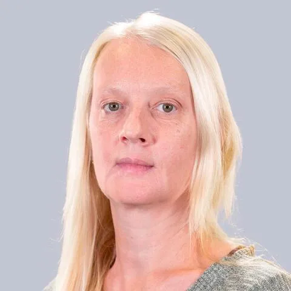

## Informations et Contact

 * **Email:** [valerie.jeanne-perrier@sorbonne-universite.fr](mailto:valerie.jeanne-perrier@sorbonne-universite.fr)
* **Profils:** [LinkedIn](https://www.linkedin.com/in/jeanne-perrier-0989b810b) | [HAL](https://hal.science/search/index/?q=%2A&rows=30&authIdPerson_i=1149584&sort=publicationDate_tdate+desc) | [Twitter](https://x.com/vjeanneperrier)

## Expertises

 Valérie Jeanne-Perrier est Professeure des universités en sciences de l'information et de la communication et directrice de l'école publique de journalisme du CELSA, école interne de la Faculté des Lettres de Sorbonne Université. Elle encadre les cursus destinés à former des professionnels des médias avec l'aide et le soutien de journalistes en poste ou de pigistes ou de chercheurs associés également actifs au sein de rédactions. Ses recherches portent sur les transformations des pratiques et des identités professionnelles des journalistes liées aux usages de nouveaux médias et sur l'analyse des interfaces des dispositifs que ceux-ci mobilisent pour exercer leur métier. Elle anime un séminaire de recherche avec Pauline Escande-Gauquié, intitulé « Médiamorphoses », qui s'inscrit dans les travaux de l'axe « Formes et écritures médiatiques et journalisme ».

## Ouvrages

 Valérie Jeanne-Perrier, Pauline Escande-Gauquié,
Médiations de la mode
, Editions Academia-Bruylant, 2021, coll « Extensions sémiotiques », 42 p.
Emmanuël Souchier, Etienne Candel, Gustavo Gomez-Mejia, Valerie Jeanne Perrier,
Le numérique comme écriture. Théories et méthode d’analyse
, Armand Colin, 2019, coll. « Codex », 358 p.
Valérie Jeanne-Perrier,
Les journalistes face aux réseaux sociaux ? - une nouvelle relation entre médias et politiques
, Editions MKF, 2018, 176 p. Valérie Jeanne-Perrier, Le partage photographique, NecPlus, 2017, 126 p.
Valérie Jeanne-Perrier,
Internet a aussi changé la mode Quand Facebook, Twitter, Instagram, Snapchat, Pinterest, YouTube, Vine, Periscope, Tumbl'r & Cie s'affichent sur le devant des podiums
, Kawa éditions, 2016, 133 p.

## Publications et communications

 Ouvrages
Valérie Jeanne-Perrier, Pauline Escande-Gauquié,
Médiations de la mode
, Editions Academia-Bruylant, 2021, coll « Extensions sémiotiques », 42 p.
Emmanuël Souchier, Etienne Candel, Gustavo Gomez-Mejia, Valerie Jeanne Perrier,
Le numérique comme écriture. Théories et méthode d’analyse
, Armand Colin, 2019, coll. « Codex », 358 p.
Valérie Jeanne-Perrier,
Les journalistes face aux réseaux sociaux ? - une nouvelle relation entre médias et politiques
, Editions MKF, 2018, 176 p. Valérie Jeanne-Perrier, Le partage photographique, NecPlus, 2017, 126 p.
Valérie Jeanne-Perrier,
Internet a aussi changé la mode Quand Facebook, Twitter, Instagram, Snapchat, Pinterest, YouTube, Vine, Periscope, Tumbl'r & Cie s'affichent sur le devant des podiums
, Kawa éditions, 2016, 133 p.

## Thématiques de recherche

 Journalisme
Transformations médiatiques des médias et des métiers du journalisme
Sémiologie et nouvelles écritures numériques
Ocean literacy et journalisme scientifique
Intelligence artificielle, nouveaux outils et processus de constructions des représentations de l'information

