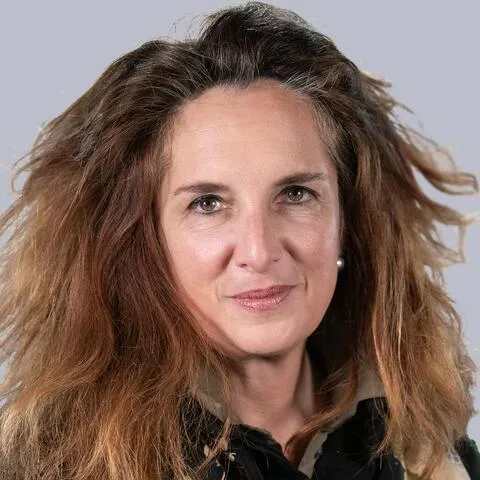

## Informations et Contact

 * **Email:** [valerie.patrin@sorbonne-universite.fr](mailto:valerie.patrin@sorbonne-universite.fr)
* **Profils:** [LinkedIn](https://www.linkedin.com/in/val%C3%A9rie-patrin-lecl%C3%A8re-5a8a0139/) | [HAL](https://hal.science/search/index/?q=%2A&rows=30&authFullName_s=Val%C3%A9rie+Patrin-Lecl%C3%A8re&sort=publicationDate_tdate+desc)

## Expertises

 Lentrepreneuriat dans le domaine des médias.

## Thématiques de recherche

 Panorama des entreprises médiatiques / Connaissance des médias
Analyse sémio-économique des transformations médiatiques (marques et médias)
Analyse des hybridations professionnelles entre professionnels des médias, du marketing et de la communication

