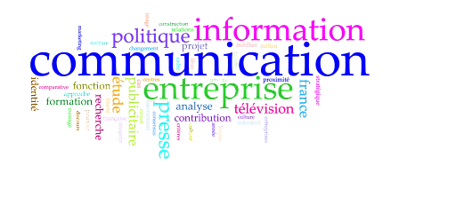
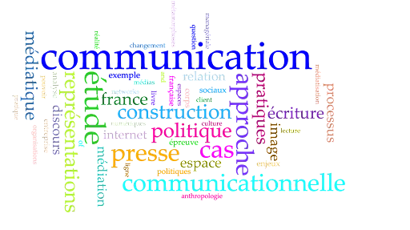

## Une formation à la recherche par la recherche

Le doctorat est un diplôme de niveau Bac + 8 destiné à ceux et celles qui se destinent à des carrières intellectuelles de haut niveau, soit dans le monde professionnel de l’enseignement et de la recherche (universités, CNRS, instituts), soit dans le monde professionnel des entreprises, organisations internationales, collectivités territoriales.

Le GRIPIC réserve un accueil particulier aux étudiants et étudiantes de doctorat : non seulement ils ont une place statutaire dans le laboratoire, en tant que membres permanents dès leur inscription et jusqu’à trois ans après leur soutenance, mais en plus ils et elles participent activement à la vie du laboratoire.

Le doctorat est un diplôme qu’on obtient après avoir rédigé et soutenu une thèse de recherche, destinée à faire progresser la connaissance dans l’axe choisi et à développer la maîtrise de méthodes rigoureuses de raisonnement et d’expérimentation.

Pour toute information officielle, consulter l’Arrêté du 25 mai 2016 fixant le cadre national de la formation et les modalités conduisant à la délivrance du diplôme national de doctorat : https://www.legifrance.gouv.fr/loda/id/JORFTEXT000032587086/

## L’admission

Deux sessions d’admission sont organisées, l’une au printemps, l’autre à l’automne. La date limite pour déposer une candidature au doctorat est généralement mi-septembre. 

## Organisation de la formation

La scolarité en doctorat ne comprend pas de cours. Néanmoins certains jalons sont posés : 

- **Comité de suivi de thèse :** chaque année à partir de la 2e année les doctorants et doctorantes constituent un comité de suivi de thèse (deux membres au choix du candidat ou de la candidate, excluant le directeur ou la directrice de recherche) pour faire état des difficultés matérielles ou psychologiques de leur travaux.
- **Mini-soutenance :** les doctorants et doctorantes présentent dès la 2e année un état de leur recherche dans le cadre du séminaire doctoral organisé par le GRIPIC, devant les enseignants-chercheurs et les enseignantes-chercheuses de l’unité et les membres en formation doctorale.
- **État d’avancement de la recherche :** après la mini-soutenance, les doctorants et doctorantes peuvent exposer leurs travaux scientifiques devant les enseignants-chercheurs et les enseignantes-chercheuses de l’unité et les membres en formation doctorale dans le cadre du séminaire de l’école doctorale-GRIPIC.
- **Suivi de séminaires de recherche (validés dans le cadre d’un portfolio) :**
  - Grand séminaire du GRIPIC
  - Séminaires thématiques du GRIPIC
  - Journées d’études 
  - Cours doctoraux, dispensés par les professeurs et professeures des différentes disciplines de l’École doctorale 433 (philosophie, linguistique, sociologie, communication, musique et musicologie)
- **Dépôt du manuscrit :** le manuscrit doit être soumis au directeur ou à la directrice de recherche qui juge de l’opportunité de soutenir devant jury. L’autorisation de présenter une thèse en soutenance est accordée par le chef ou la cheffe d’établissement, après avis de la direction de l’École doctorale, sur proposition du directeur ou de la directrice de recherche. 
- **Constitution d’un jury :** le directeur ou à la directrice de recherche siège dans le jury et le constitue : ce dernier comprend entre trois et six membres, à parité de genre, majoritairement habilité·e·s à diriger des recherches, et pour un tiers au moins extérieurs à l’École doctorale et à l’établissement.
- **Soutenance :** la soutenance est organisée dans les locaux du CELSA ou de l’École doctorale. Elle comprend un exposé liminaire du candidat ou de la candidate, suivi par les interventions successives des membres du jury.

## Durée des études

Les textes en vigueur recommandent une durée de 3 ans pour la préparation du doctorat.

## Financement

Des informations sont sur le site du Ministère : https://www.etudiant.gouv.fr/fr/financement-doctoral-523

Les sources de financement les plus courantes sont les contrats doctoraux et les CIFRE : 
- **les contrats doctoraux** sont accessibles sur concours aux étudiants et étudiantes en 2e année de master « Recherche » et aux doctorants et doctorantes inscrit·e·s depuis moins de six mois. Ce sont des bourses accordées sans contrepartie pour me durée de 3 ans par l’école doctorale.
- **les Conventions industrielles de formation par la recherche (CIFRE)** sont accessibles aux doctorants et doctorantes de 1e année qui acceptent le principe d’une alternance pendant 3 ans : moitié en entreprise, moitié au GRIPIC.

## Liste des thèses soutenues depuis la création du GRIPIC

Plus de 150 thèses ont été soutenues depuis la création du GRIPIC. Les deux nuages de mots ci-dessous illustrent les choix thématiques faits entre 1970 et 1999 (fig. 1) et entre 2000 et 2022 (fig. 2).

<strong>Fig. 1. — Nuage de mots constitué avec les titres des thèses soutenues au GRIPIC entre 1972 et 1999</strong>

<strong>Fig. 2. — Nuage de mots constitué avec les titres des thèses soutenues au GRIPIC entre 2000 et 2022</strong>

## Association des doctorants et doctorantes du GRIPIC

Une association des doctorants et doctorantes du GRIPIC s’est constituée le 15 janvier 2014 : l’ADAGE (Association des doctorants au GRIPIC). On peut les contacter utilement pour recueillir des témoignages ou proposer des offres de service ou des offres d’emploi.

[En savoir plus / En savoir +](https://ed433.sorbonne-universite.fr)

