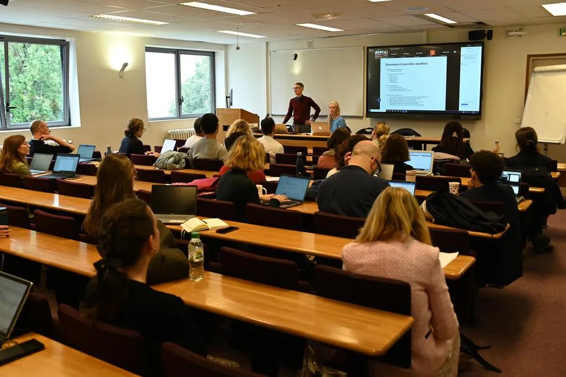

## Presentation

The Interdisciplinary Research Group on Information and Communication Processes (Groupe de recherches interdisciplinaires sur les processus d'information et de communication, GRIPIC, UR1498) is an autonomous research unit specializing in communication studies.

Housed at Sorbonne University’s School of Advanced Studies in Information and Communication Sciences (CELSA), the group brings together about one hundred researchers including permanent members (professors and doctoral students) and associates from other institutions.

GRIPIC’s multifaceted and multidisciplinary research revolves around the core idea that communication processes are structured and structuring, and that these processes must be analyzed in their social, semiotic, historical and political dimensions. In addition, GRIPIC is dedicated to training young scholars from Sorbonne University’s 'Concepts and languages' doctoral school ([ED433](https://lettres.sorbonne-universite.fr/ecoles-doctorales/concepts-et-langages)).

## Research and Collaboration

GRIPIC members work within the frameworks of individual and collective research, research contracts, and studies with public or private institutional partners. While members are committed to Sorbonne University institutes and networks, they also collaborate with colleagues from other disciplines. They regularly participate in international and interdisciplinary colloquia and engage in academic exchanges with their peers. Through their publications and their partnerships with journals and publishing houses, they actively contribute to the advancement of information and communication sciences. Through interviews, social networks, and other links with the media, they raise the visibility of scholarly research and help advance the pursuit of science.

Members of GRIPIC participate in regular meetings throughout the year. These sessions include a seminar (known as 'Le grand séminaire') where members present their work, as well as thematic seminars led by members. Another series provides doctoral students the opportunity to present their work. There are also 'gripicales,' small workshops devoted to training members in the role of teacher-researcher.

A major center for communication research, GRIPIC is part of the network of forty French members of the Permanent Conference of Laboratory Directions in Information and Communication Sciences (Conférence permanente des directions de laboratoires en Sciences de l’information et de la communication, CPDirSIC, [http://cpdirsic.fr](http://cpdirsic.fr)).

<h3 style='color: #fff; margin-top: 0; font-weight: bold; text-transform: uppercase;'>THE GRIPIC IN A FEW DATES</h3>
<strong>1965.</strong> — Creation of the Centre d'études littéraires et scientifiques appliquées (CELSA)

<strong>1968.</strong> — Opening of postgraduate training at CELSA

<strong>1975.</strong> — Ministerial agreement for CELSA to award doctorates in communication studies

<strong>1991.</strong> — The research center is labeled 'place of reception' (équipe d’accueil) by the French Ministry of Higher Education, Research and Sports

<strong>1999.</strong> — Creation of GRIPIC, headed by Jean-Baptiste Carpentier

<strong>2000-2007.</strong> — Yves Jeanneret (director)

<strong>2007-2012.</strong> — Emmanuël Souchier (director)

<strong>2013-2014.</strong> — Karine Berthelot-Guiet and Adeline Wrona (co-directors)

<strong>2014-2018.</strong> — Adeline Wrona and Pauline Escande Gauquié (director and deputy director)

<strong>2019-2021.</strong> — Joëlle Le Marec, Sophie Corbillé and Julien Tassel (director and deputy directors)

<strong>2021.</strong> — Sophie Corbillé and Julien Tassel (co-directors)

<strong>2022.</strong> — Pascal Froissart and Sophie Corbillé (director and deputy director)

