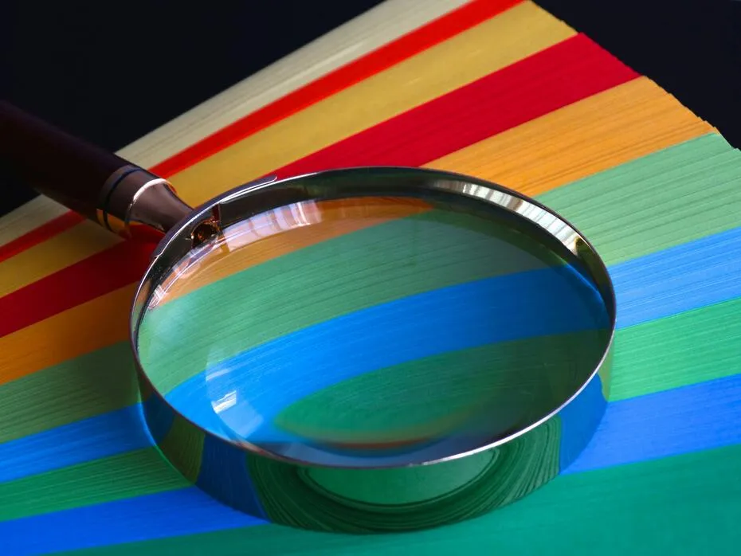

## Presentación

El Grupo de Investigación Interdisciplinar en Procesos de la Información y la Comunicación (Groupe de recherches interdisciplinaires sur les processus dinformation et de communication, GRIPIC, UR1498) es una unidad de investigación autónoma especializada en ciencias de la información y la comunicación. Mantiene estrechos vínculos con CELSA, la Escuela de Estudios Avanzados en Ciencias de la Información y la Comunicación de la Universidad de la Sorbona, acogiendo a sus docentes-investigadores.

GRIPIC reúne en la actualidad a un centenar de investigadores: permanentes (docentes-investigadores y doctorandos), o asociados (miembros de otras instituciones). En el seno de las ciencias de la información y la comunicación (sección 71 del Consejo Nacional de Universidades), la unidad federa investigaciones en torno a la idea de que los procesos de comunicación se estructuran y estructuran, y que deben ser analizados en sus aspectos sociales, semióticos, históricos y políticos. Su objetivo es también formar a jóvenes investigadores de la escuela de doctorado Conceptos y lenguajes de la Sorbona ([ED433](https://lettres.sorbonne-universite.fr/ecoles-doctorales/concepts-et-langages)), que emprenden su doctorado en ciencias de la información y la comunicación.

## Investigación y Colaboración

Los miembros del GRIPIC trabajan en el marco de investigaciones individuales y colectivas, contratos de investigación o estudios con socios institucionales públicos o privados. Comprometidos con los institutos y redes de la Universidad de la Sorbona, desarrollan trabajo con colegas de otras disciplinas. Participan regularmente en coloquios internacionales e interdisciplinarios, y confrontan sus puntos de vista con sus pares. A través de sus publicaciones y sus alianzas con revistas y editoriales, contribuyen activamente al avance de las ciencias de la información y la comunicación. A través de sus vínculos con los medios de comunicación (entrevistas, redes sociales, etc.), también despiertan el interés por la investigación académica y participan en la mediación de la ciencia.

La vida del equipo se organiza finalmente en torno a diversos encuentros a lo largo del año: las sesiones del seminario GRIPIC (conocido como el seminario mayor); los seminarios temáticos dirigidos por sus miembros; los seminarios de doctorado dedicados a las presentaciones de trabajos de doctorandos; y los gripicales, pequeños talleres dedicados a la formación en el oficio de docente-investigador.

Importante centro de investigación en comunicación, GRIPIC forma parte de la red de cuarenta miembros franceses de la Conferencia Permanente de Gestión de Laboratorios de Ciencias de la Información y la Comunicación (Conférence permanente des directions de laboratoires en Sciences de l’information et de la communication, CPDirSIC, [http://cpdirSIC.fr](http://cpdirSIC.fr)).

<h3 style=color: #fff; margin-top: 0; font-weight: bold; text-transform: uppercase;>GRIPIC EN UNAS FECHAS</h3>
<strong>1965.</strong> — Creación de un centro de estudios e investigación en el CELSA

<strong>1968.</strong> — Obertura de una formación de 3e ciclo en el CELSA

<strong>1975.</strong> — Autorización de CELSA para otorgar doctorados en ciencias de la información y la comunicación

<strong>1991.</strong> — El centro de investigación es calificado como équipe d’accueil por el Ministerio de Educación Superior, Investigación y Deporte

<strong>1999.</strong> — Creación del GRIPIC, dirigido por Jean-Baptiste Carpentier

<strong>2000-2007.</strong> — Yves Jeanneret (director)

<strong>2007-2012.</strong> — Emmanuël Souchier (director)

<strong>2013-2014.</strong> — Karine Berthelot-Guiet y Adeline Wrona (codirectoras)

<strong>2014-2018.</strong> — Adeline Wrona y Pauline Escande-Gauquié (directora y directora adjunta)

<strong>2019-2021.</strong> — Joëlle Le Marec, Sophie Corbillé y Julien Tassel (directora, directora adjunta y director adjunto)

<strong>2021.</strong> — Sophie Corbillé y Julien Tassel (codirectora y codirector)

<strong>2022.</strong> — Pascal Froissart y Sophie Corbillé (director y directora adjunta)

